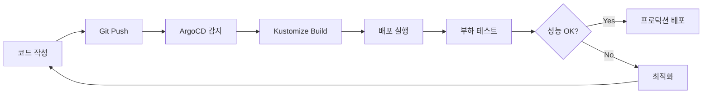

# 실전 Kubernetes 섹션 추가 완료 리포트

## 📋 작업 요약

AKS Workshop에 **실전 Kubernetes** 섹션을 새로 추가하고, Kustomize, ArgoCD, 부하 테스트에 대한 상세 문서를 작성했습니다.

---

## ✅ 완료된 작업

### 1. 새로운 메뉴 구조 생성 ✅

**변경 사항**:
- "실전 Kubernetes" 메뉴 추가
- Kustomize를 "Kubernetes 기초"에서 "실전 Kubernetes"로 이동
- ArgoCD 및 부하 테스트 추가

**파일**: `docs/sidebars.ts`

```typescript
{
  type: "category",
  label: "실전 Kubernetes",
  items: [
    "production/intro",
    "production/kustomize",
    "production/argocd",
    "production/load-testing",
  ],
}
```

### 2. 실전 Kubernetes 소개 문서 작성 ✅

**파일**: `docs/docs/production/intro.md` (82줄)

**내용**:
- 학습 목표 및 워크플로우
- Kustomize, ArgoCD, 부하 테스트 개요
- 학습 순서 및 환경 준비
- Mermaid 다이어그램으로 실전 워크플로우 시각화

### 3. ArgoCD 상세 문서 작성 ✅

**파일**: `docs/docs/production/argocd.md` (1,557줄)

**주요 섹션**:

#### 기본 개념 및 설치
- ArgoCD란? (GitOps 원칙, 특징, 비교표)
- 설치 방법 (3가지: Port Forward, LoadBalancer, Ingress)
- CLI 설치 및 초기 설정
- 초기 패스워드 확인 및 변경

#### 첫 번째 애플리케이션 배포
- 샘플 애플리케이션 구조
- Application 생성 (3가지 방법: CLI, Manifest, UI)
- 동기화 확인 및 업데이트 테스트

#### Kustomize 통합
- Kustomize 기반 애플리케이션 구조
- 환경별 Application 생성 (dev, staging, production)
- ApplicationSet으로 다중 환경 관리

#### 고급 기능
- **Sync Waves**: 리소스 배포 순서 제어
- **Sync Hooks**: PreSync, PostSync, SyncFail 훅 활용
- **Progressive Delivery**: Blue-Green, Canary 배포
- **Multi-Cluster 관리**: 여러 클러스터를 단일 ArgoCD로 관리

#### Best Practices
- Git Repository 구조 (App of Apps 패턴)
- Sync Policy 전략 (환경별 권장 설정)
- RBAC 설정 (프로젝트별 권한 분리)
- 알림 설정 (Slack 통합)
- 보안 (Private Repository, Sealed Secrets)
- 모니터링 (Prometheus, Grafana)
- 재해 복구 (백업 및 복원)
- 성능 최적화 (대규모 환경 설정)

#### 문제 해결
- Application 동기화 실패
- Health Check 실패
- Sync 성능 문제
- Repository 접근 문제
- 자주 발생하는 오류 해결 방법

### 4. 부하 테스트 상세 문서 작성 ✅

**파일**: `docs/docs/production/load-testing.md` (1,812줄)

**주요 섹션**:

#### 부하 테스트 기초
- 테스트 유형 (Load, Stress, Spike, Soak Testing)
- 각 테스트 유형별 목적, 지속 시간, 부하 패턴
- 부하 테스트의 필요성

#### 테스트 도구 (5가지)
1. **k6 (권장)**
   - 설치 방법 (CLI, Kubernetes Operator)
   - 기본 테스트 스크립트 작성
   - Kubernetes에서 실행
   - Custom metrics 및 thresholds 설정

2. **Locust**
   - Python 기반 부하 테스트
   - 웹 UI 제공
   - 분산 테스트 지원
   - Kubernetes 배포 (Master/Worker 구조)

3. **Apache Bench (ab)**
   - 간단한 HTTP 벤치마크
   - 다양한 옵션 (POST, Keep-Alive, CSV 출력)
   - Kubernetes Job으로 실행

4. **JMeter**
   - 종합 성능 테스트 도구
   - GUI 및 CLI 모드
   - Kubernetes에서 실행

5. **Hey**
   - Go 기반 HTTP 부하 생성
   - 단일 바이너리
   - Rate limiting 지원

#### 실전 부하 테스트 시나리오
1. **전자상거래 사이트**: 홈페이지 → 상품 목록 → 상세 → 장바구니 → 결제
2. **API Stress Test**: 점진적 부하 증가로 한계점 파악
3. **Spike Test**: 급격한 트래픽 증가 대응 테스트
4. **Soak Test**: 8시간 장기 안정성 테스트

#### 성능 메트릭 수집
- Prometheus로 메트릭 수집
- 주요 메트릭 (응답 시간, 처리량, 에러율)
- Grafana 대시보드 구성

#### 병목 지점 식별
1. **애플리케이션 레벨**: CPU/Memory, 로그, 프로파일링
2. **데이터베이스 레벨**: 슬로우 쿼리, Connection Pool
3. **네트워크 레벨**: 지연, 패킷 손실, DNS
4. **인프라 레벨**: 노드 리소스, Disk I/O

#### 성능 최적화
1. **애플리케이션 최적화**: 캐싱, Connection Pooling
2. **리소스 튜닝**: Requests/Limits, JVM 튜닝
3. **HPA 최적화**: Metrics, Behavior 설정
4. **데이터베이스 최적화**: Read Replica, PgBouncer
5. **네트워크 최적화**: Circuit Breaking, Keep-Alive

#### 주의사항
- 프로덕션 환경 테스트 금지
- 리소스 격리 (별도 네임스페이스)
- 점진적 부하 증가
- 현실적인 시나리오
- 외부 의존성 고려 (Mock 서비스)
- 전체 스택 모니터링
- 법적/윤리적 고려사항

#### Best Practices
- 테스트 계획 수립
- 단계별 접근 (Baseline → Smoke → Load → Stress → Spike → Soak)
- 결과 분석 템플릿
- 지속적 개선 (자동화된 파이프라인)

### 5. README 업데이트 ✅

**파일**: `README.md`

**변경 사항**:
- "실전 Kubernetes" 섹션 추가 (NEW! 🚀 표시)
- Kustomize, ArgoCD, 부하 테스트 링크 추가
- 각 문서에 대한 간단한 설명 추가

### 6. 문서 간 연결 ✅

**업데이트된 파일**:
- `docs/docs/kubernetes-basics/intro.md`: Kustomize 참조 제거, 실전 Kubernetes 섹션 안내 추가
- `docs/docs/production/intro.md`: 각 주제로 연결되는 개요 제공

---

## 📊 통계

| 항목 | 수치 |
|------|------|
| 새로 작성된 문서 | 4개 |
| 총 라인 수 | 3,533줄 |
| - intro.md | 82줄 |
| - kustomize.md | 1,352줄 (기존 문서 이동) |
| - argocd.md | 1,557줄 |
| - load-testing.md | 1,812줄 |
| ArgoCD 주요 섹션 | 8개 |
| 부하 테스트 도구 | 5개 |
| 실전 시나리오 | 4개 |
| 최적화 기법 | 5개 카테고리 |

---

## 🎯 핵심 내용

### ArgoCD

**GitOps 자동화**:
- Git을 신뢰할 수 있는 단일 소스로 사용
- 자동 동기화 및 Drift 감지
- 즉각적인 롤백 기능

**주요 기능**:
- Kustomize 네이티브 지원
- Sync Waves로 배포 순서 제어
- Sync Hooks (PreSync, PostSync, SyncFail)
- Progressive Delivery (Blue-Green, Canary)
- Multi-cluster 관리
- ApplicationSet으로 다중 환경 자동화

**Best Practices**:
- App of Apps 패턴
- 환경별 Sync Policy (dev: 자동, production: 수동)
- RBAC 프로젝트별 권한 분리
- Sealed Secrets로 보안 강화
- Prometheus/Grafana 모니터링

### 부하 테스트

**도구 선택 가이드**:
- **k6**: 현대적, Kubernetes 네이티브, Prometheus 통합 (권장)
- **Locust**: Python 기반, 웹 UI, 복잡한 시나리오
- **Apache Bench**: 간단한 HTTP 벤치마크
- **JMeter**: 종합 성능 테스트, GUI 제공
- **Hey**: 빠르고 간단한 HTTP 부하 생성

**테스트 유형**:
| 유형 | 목적 | 부하 패턴 | 지속 시간 |
|------|------|----------|----------|
| Load Testing | 정상 부하 성능 | 일정 | 10-30분 |
| Stress Testing | 한계점 파악 | 점진적 증가 | 30분-1시간 |
| Spike Testing | 급격한 트래픽 | 급증/감소 | 5-15분 |
| Soak Testing | 장기 안정성 | 일정 | 4-24시간 |

**최적화 전략**:
1. 애플리케이션: 캐싱, Connection Pooling
2. 리소스: Requests/Limits 튜닝
3. HPA: Metrics 및 Behavior 최적화
4. 데이터베이스: Read Replica, PgBouncer
5. 네트워크: Circuit Breaking, Keep-Alive

---

## 🔍 실전 워크플로우



---

## 📚 문서 구조

```
docs/docs/production/
├── intro.md              # 실전 Kubernetes 소개
├── kustomize.md          # 환경별 구성 관리 (1,352줄)
├── argocd.md             # GitOps 지속적 배포 (1,557줄)
└── load-testing.md       # 부하 테스트 및 최적화 (1,812줄)
```

---

## ✅ 실습 체크리스트

### Kustomize
- [ ] Base 리소스 작성
- [ ] Overlay 구성 (dev, staging, production)
- [ ] ConfigMap/Secret 관리
- [ ] GitOps 워크플로우 구성
- [ ] Best Practices 적용

### ArgoCD
- [ ] ArgoCD 설치
- [ ] 첫 번째 Application 배포
- [ ] Kustomize 통합
- [ ] Sync Waves 및 Hooks 활용
- [ ] Multi-cluster 설정
- [ ] RBAC 구성
- [ ] 모니터링 설정

### 부하 테스트
- [ ] k6 설치 및 기본 테스트
- [ ] 실전 시나리오 작성
- [ ] Prometheus/Grafana 메트릭 수집
- [ ] 병목 지점 식별
- [ ] 성능 최적화 적용
- [ ] CI/CD 파이프라인 통합

---

## 🚀 다음 단계

1. **문서 빌드 및 배포**:
   ```bash
   cd docs
   npm install
   npm run build
   npm run serve
   ```

2. **실습 진행**:
   - Kustomize로 환경별 구성 관리
   - ArgoCD로 GitOps 워크플로우 구축
   - 부하 테스트로 성능 검증

3. **추가 개선 사항** (선택):
   - [ ] Argo Rollouts 통합 (Progressive Delivery)
   - [ ] Argo Events 추가 (Event-driven 워크플로우)
   - [ ] 부하 테스트 자동화 스크립트 작성
   - [ ] 성능 벤치마크 기준선 설정

---

## 🎉 완료!

**실전 Kubernetes** 섹션이 성공적으로 추가되었습니다!

- ✅ 3개의 상세 문서 (총 3,533줄)
- ✅ Kustomize, ArgoCD, 부하 테스트 완벽 커버
- ✅ Best Practices 및 실전 예제 포함
- ✅ 단계별 실습 가이드 제공
- ✅ 문제 해결 및 최적화 방법 상세 설명

이제 실무 환경에서 Kubernetes를 효과적으로 운영할 수 있는 모든 지식이 준비되었습니다! 🚀
