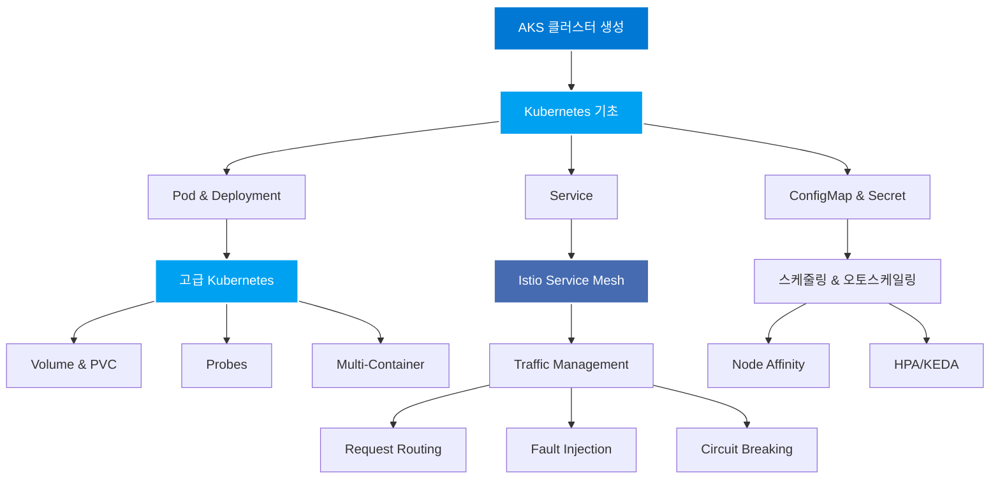

# AKS Workshop

[](https://dotnetpower.github.io/aks-workshop/)
[](https://opensource.org/licenses/MIT)
[](https://kubernetes.io/)
[](https://azure.microsoft.com/ko-kr/services/kubernetes-service/)
[](https://istio.io/)
[](https://docusaurus.io/)
[](https://prometheus.io/)
[](https://grafana.com/)
[](https://www.jaegertracing.io/)
[](https://kiali.io/)

Azure Kubernetes Service(AKS)를 처음부터 구성하고, Kubernetes의 핵심 개념부터 고급 기능까지 단계별 실습을 통해 학습하는 종합 워크샵입니다.

## 워크샵 개요

이 워크샵은 Azure 클라우드 환경에서 Kubernetes를 실제로 운영하는데 필요한 모든 지식을 제공합니다. 기본적인 컨테이너 배포부터 시작하여 마이크로서비스 아키텍처를 위한 서비스 메시까지, 실무에서 바로 활용 가능한 실습 중심의 내용으로 구성되어 있습니다.

각 주제는 이론 설명과 함께 직접 따라할 수 있는 실습 예제를 포함하고 있으며, 모든 YAML 파일과 스크립트는 검증된 코드로 제공됩니다.

:::note
이 워크샵의 일부 콘텐츠는 AI를 활용하여 생성되었습니다. 따라서 일부 내용이 실제와 다를 수 있으나, 학습 목적에 맞춰 구성되었으므로 Kubernetes와 AKS의 핵심 개념을 이해하는 데 집중해 주시기 바랍니다.
:::

## 워크샵 주제

### 🎯 Kubernetes 기초
* **Deployment 관리**: 기본 배포부터 고급 배포 전략까지
* **Service**: ClusterIP, NodePort, LoadBalancer
* **설정 관리**: ConfigMap과 Secret
* **배포 전략**: Blue-Green, Canary 배포

### 🚀 고급 Kubernetes
* **스토리지**: Volumes, PersistentVolume, PersistentVolumeClaim
* **네트워킹**: Ingress Controller, Path 기반 라우팅
* **안정성**: Liveness, Readiness, Startup Probes
* **고급 패턴**: Init Container, Multi-Container Pods
* **작업 스케줄링**: Jobs, CronJobs

### 📊 Pod 스케줄링
* **Affinity**: Node Affinity, Pod Affinity/Anti-Affinity
* **고급 스케줄링**: Taint & Toleration, Topology Spread
* **상태 관리**: StatefulSet을 통한 고가용성

### ⚡ 오토스케일링 & 리소스 관리
* **리소스 관리**: Requests/Limits, LimitRange, ResourceQuota
* **HPA**: CPU/Memory 기반 자동 스케일링
* **KEDA**: Event-driven Autoscaling
  * RabbitMQ 큐 기반 스케일링
  * Cron 기반 시간별 스케일링

### 🔧 Service Mesh (Istio)
* **Traffic Management**: Request Routing, Traffic Shifting
* **Resilience**: Fault Injection, Circuit Breaking
* **Security**: Authorization, mTLS
* **Observability**: Prometheus, Grafana, Jaeger, Kiali

## 🎓 학습 목표

이 워크샵을 완료하면 다음을 할 수 있습니다:

- ✅ AKS 클러스터 생성 및 관리
- ✅ Kubernetes 리소스 배포 및 운영
- ✅ 다양한 배포 전략 구현
- ✅ 스토리지 및 네트워킹 구성
- ✅ Pod 스케줄링 최적화
- ✅ 자동 스케일링 구현
- ✅ Istio를 통한 마이크로서비스 관리
- ✅ 모니터링 및 관찰성 구현

## 🚀 시작하기

이 워크샵을 시작하려면 다음 단계를 따라주세요:

1. **[사전 환경 설정](./setup/prerequisites)** - Azure CLI, kubectl, Helm 설치
2. **[클러스터 구성](./setup/cluster-setup)** - AKS 클러스터 생성 및 Istio 활성화
3. **[Bookinfo 배포](./setup/bookinfo)** - 샘플 애플리케이션 배포
4. **실습 진행** - 각 카테고리별 실습 문서 참고

## 🧪 테스트 및 검증

### 자동 테스트

```bash
# 환경 변수 설정
source ./istio-env.sh

# 테스트 실행
./test-workshop.sh
```

### 리소스 정리

```bash
# 테스트 리소스만 정리
./cleanup-workshop.sh --test

# 모든 리소스 정리
./cleanup-workshop.sh --all
```

자세한 내용은 [TESTING.md](https://github.com/dotnetpower/aks-workshop/blob/main/TESTING.md) 참고

## 🤝 기여하기

이 프로젝트에 기여하고 싶으신가요?

1. Fork the repository
2. Create your feature branch
3. Commit your changes
4. Push to the branch
5. Create a Pull Request

## 📐 워크샵 아키텍처

이 워크샵에서 다루는 주요 개념들의 관계를 시각화한 다이어그램입니다:



## 📄 라이선스

MIT License

## 📞 지원

문제가 발생하거나 질문이 있으시면:
- [GitHub Issues](https://github.com/dotnetpower/aks-workshop/issues)
- [GitHub Discussions](https://github.com/dotnetpower/aks-workshop/discussions)
