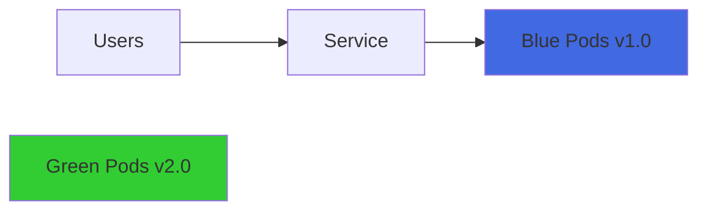
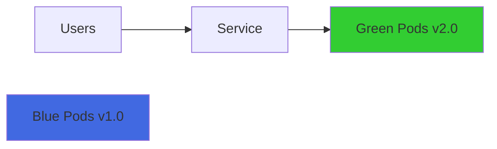

# Blue-Green Deployments

Blue-Green 배포는 두 개의 동일한 프로덕션 환경을 유지하면서 무중단으로 새 버전을 배포하는 전략입니다.

## Blue-Green 배포란?

Blue-Green 배포 전략의 핵심 개념:

* **Blue**: 현재 프로덕션 환경에서 실행 중인 버전
* **Green**: 새로운 버전을 배포할 환경
* **즉시 전환**: Service의 selector를 변경하여 트래픽을 즉시 전환
* **빠른 롤백**: 문제 발생 시 selector를 다시 변경하여 즉시 이전 버전으로 복귀

## 작동 원리



배포 후:



## Blue Deployment 생성

### 1. Blue Deployment

```yaml title="blue-dep.yaml"
apiVersion: apps/v1
kind: Deployment
metadata:
  name: blue-dep
spec:
  replicas: 3
  selector:
    matchLabels:
      target: blue-dep
  template:
    metadata:
      labels:
        target: blue-dep
        app: status
        color: blue
    spec:
      nodeSelector:
        kubernetes.io/os: linux
      containers:
        - name: servicedemo
          image: scubakiz/servicedemo:1.0
          ports:
            - containerPort: 80
              protocol: TCP
          imagePullPolicy: Always
          env:
            - name: IMAGE_COLOR
              value: blue
            - name: NODE_IP
              valueFrom:
                fieldRef:
                  fieldPath: status.hostIP
            - name: NODE_NAME
              valueFrom:
                fieldRef:
                  fieldPath: spec.nodeName
            - name: POD_IP
              valueFrom:
                fieldRef:
                  fieldPath: status.podIP
            - name: POD_NAME
              valueFrom:
                fieldRef:
                  fieldPath: metadata.name
            - name: POD_NAMESPACE
              valueFrom:
                fieldRef:
                  fieldPath: metadata.namespace
```

### 2. Production Service (Blue)

```yaml title="production-svc-blue.yaml"
apiVersion: v1
kind: Service
metadata:
  name: production-svc
  labels:
    color: blue
spec:
  ports:
    - name: web
      port: 8080
      targetPort: 80
  selector:
    target: blue-dep  # Blue Deployment를 선택
  type: LoadBalancer
```

### 3. Blue 환경 배포

```bash
# Blue Deployment 생성
kubectl apply -f blue-dep.yaml

# Production Service 생성 (Blue를 가리킴)
kubectl apply -f production-svc-blue.yaml

# 상태 확인
kubectl get deployments
kubectl get pods -l target=blue-dep
kubectl get services production-svc
```

### 4. 외부 IP 확인 및 테스트

```bash
# LoadBalancer IP 확인
kubectl get service production-svc

# IP가 할당될 때까지 대기
kubectl get service production-svc --watch

# 브라우저에서 접속 또는 curl 테스트
EXTERNAL_IP=$(kubectl get service production-svc -o jsonpath='{.status.loadBalancer.ingress[0].ip}')
curl http://$EXTERNAL_IP:8080

# 반복 테스트 (Blue 이미지 확인)
while sleep 1; do curl -s http://$EXTERNAL_IP:8080 | grep -i "POD IP:"; done
```

## Green Deployment 생성 및 전환

### 1. Green Deployment

```yaml title="green-dep.yaml"
apiVersion: apps/v1
kind: Deployment
metadata:
  name: green-dep
spec:
  replicas: 3
  selector:
    matchLabels:
      target: green-dep
  template:
    metadata:
      labels:
        target: green-dep
        app: status
        color: green
    spec:
      nodeSelector:
        kubernetes.io/os: linux
      containers:
        - name: servicedemo
          image: scubakiz/servicedemo:1.0
          ports:
            - containerPort: 80
              protocol: TCP
          imagePullPolicy: Always
          env:
            - name: IMAGE_COLOR
              value: green  # Blue와의 차이점
            - name: NODE_IP
              valueFrom:
                fieldRef:
                  fieldPath: status.hostIP
            - name: NODE_NAME
              valueFrom:
                fieldRef:
                  fieldPath: spec.nodeName
            - name: POD_IP
              valueFrom:
                fieldRef:
                  fieldPath: status.podIP
            - name: POD_NAME
              valueFrom:
                fieldRef:
                  fieldPath: metadata.name
            - name: POD_NAMESPACE
              valueFrom:
                fieldRef:
                  fieldPath: metadata.namespace
```

### 2. Green 환경 배포

```bash
# Green Deployment 생성
kubectl apply -f green-dep.yaml

# 상태 확인
kubectl get deployments
kubectl get pods -l target=green-dep

# 이 시점에서는 Green Pods가 생성되었지만 트래픽을 받지 않음
```

### 3. Service를 Green으로 전환

```yaml title="production-svc-green.yaml"
apiVersion: v1
kind: Service
metadata:
  name: production-svc
  labels:
    color: green  # 라벨 변경
spec:
  ports:
    - name: web
      port: 8080
      targetPort: 80
  selector:
    target: green-dep  # Green Deployment를 선택
  type: LoadBalancer
```

```bash
# Service 업데이트 (트래픽 전환)
kubectl apply -f production-svc-green.yaml

# Service 확인
kubectl describe service production-svc
```

### 4. 트래픽 전환 확인

```bash
# 기존 브라우저 세션 확인
# - 기존 세션은 계속 Blue를 보여줌 (세션 유지)

# 새 브라우저 또는 새 세션에서 접속
# - 새 세션은 Green을 보여줌

# curl로 확인
while sleep 1; do curl -s http://$EXTERNAL_IP:8080 | grep -i "color\|POD IP:"; done
```

:::info 세션 유지
LoadBalancer의 세션 어피니티로 인해 기존 클라이언트는 계속 동일한 Pod에 연결될 수 있습니다. 새로운 연결만 Green 환경으로 라우팅됩니다.
:::

## 단계별 Blue-Green 배포 실습

### 1단계: Blue 환경 배포

```bash
# Blue Deployment와 Service 생성
kubectl apply -f blue-dep.yaml
kubectl apply -f production-svc-blue.yaml

# Pod가 Ready 상태가 될 때까지 대기
kubectl wait --for=condition=ready pod -l target=blue-dep --timeout=60s

# LoadBalancer IP 할당 대기
kubectl get service production-svc --watch
# Ctrl+C로 중지

# 외부 IP 가져오기
EXTERNAL_IP=$(kubectl get service production-svc -o jsonpath='{.status.loadBalancer.ingress[0].ip}')
echo "Production Service URL: http://$EXTERNAL_IP:8080"

# 브라우저에서 접속하여 Blue 이미지 확인
```

### 2단계: Green 환경 준비

```bash
# Green Deployment 생성
kubectl apply -f green-dep.yaml

# Green Pod가 Ready 상태가 될 때까지 대기
kubectl wait --for=condition=ready pod -l target=green-dep --timeout=60s

# 두 Deployment 모두 실행 중 확인
kubectl get deployments
kubectl get pods -l 'target in (blue-dep,green-dep)'
```

### 3단계: 트래픽 전환 (Blue → Green)

```bash
# Service를 Green으로 전환
kubectl apply -f production-svc-green.yaml

# Service selector 확인
kubectl get service production-svc -o yaml | grep -A 2 "selector:"

# Endpoint 확인 (Green Pod IP로 변경됨)
kubectl get endpoints production-svc
```

### 4단계: 검증 및 모니터링

```bash
# 새 연결로 Green 환경 확인
curl http://$EXTERNAL_IP:8080

# 반복 테스트
for i in {1..10}; do
  curl -s http://$EXTERNAL_IP:8080 | grep -E "color|version"
  sleep 1
done

# Pod 상태 모니터링
kubectl get pods -l 'target in (blue-dep,green-dep)' --watch
```

### 5단계: Blue 환경 정리 (선택사항)

```bash
# Green이 안정적으로 동작하면 Blue 제거
kubectl delete deployment blue-dep

# 남은 리소스 확인
kubectl get deployments
kubectl get pods
```

## 롤백 (Green → Blue)

문제가 발견되면 즉시 Blue로 롤백:

```bash
# 1. Blue Deployment가 여전히 존재하는 경우
kubectl apply -f production-svc-blue.yaml

# 2. Blue Deployment를 삭제한 경우 (재생성 필요)
kubectl apply -f blue-dep.yaml
kubectl wait --for=condition=ready pod -l target=blue-dep --timeout=60s
kubectl apply -f production-svc-blue.yaml

# Service selector 확인
kubectl get service production-svc -o yaml | grep -A 2 "selector:"
```

## Blue-Green 배포의 장단점

### 장점

* ✅ **즉시 전환**: Service selector만 변경하면 즉시 전환
* ✅ **빠른 롤백**: 문제 발생 시 즉시 이전 버전으로 복귀
* ✅ **테스트 용이**: Green 환경을 프로덕션과 동일하게 테스트
* ✅ **다운타임 없음**: 무중단 배포

### 단점

* ❌ **리소스 비용**: 두 배의 리소스 필요 (Blue + Green)
* ❌ **데이터베이스**: 데이터베이스 스키마 변경 시 복잡
* ❌ **세션 관리**: 기존 세션 처리 고려 필요

## 실전 팁

### 1. 헬스 체크

Green 환경이 완전히 준비되었는지 확인:

```bash
# 모든 Pod가 Ready인지 확인
kubectl wait --for=condition=ready pod -l target=green-dep --timeout=300s

# 헬스 체크 엔드포인트 테스트
GREEN_POD=$(kubectl get pod -l target=green-dep -o jsonpath='{.items[0].metadata.name}')
kubectl exec $GREEN_POD -- curl -s http://localhost/health
```

### 2. Smoke Test

트래픽 전환 전 Green 환경 테스트:

```bash
# Port-forward로 Green 환경 직접 테스트
kubectl port-forward deployment/green-dep 8081:80 &

# 테스트
curl http://localhost:8081

# Port-forward 종료
kill %1
```

### 3. 점진적 전환 (Service Mesh 없이)

두 개의 Service를 사용하여 점진적 테스트:

```yaml
# Staging Service (내부 테스트용)
apiVersion: v1
kind: Service
metadata:
  name: staging-svc
spec:
  selector:
    target: green-dep
  ports:
    - port: 8080
      targetPort: 80
  type: ClusterIP

---
# Production Service
apiVersion: v1
kind: Service
metadata:
  name: production-svc
spec:
  selector:
    target: blue-dep
  ports:
    - port: 8080
      targetPort: 80
  type: LoadBalancer
```

## 자동화 스크립트

```bash title="blue-green-deploy.sh"
#!/bin/bash

CURRENT_COLOR=$1  # blue 또는 green
NEW_COLOR=$2      # green 또는 blue

echo "=== Blue-Green Deployment ==="
echo "Current: $CURRENT_COLOR"
echo "New: $NEW_COLOR"

# 1. 새 버전 배포
echo "1. Deploying $NEW_COLOR environment..."
kubectl apply -f ${NEW_COLOR}-dep.yaml

# 2. 헬스 체크 대기
echo "2. Waiting for $NEW_COLOR pods to be ready..."
kubectl wait --for=condition=ready pod -l target=${NEW_COLOR}-dep --timeout=300s

# 3. Smoke test
echo "3. Running smoke tests..."
NEW_POD=$(kubectl get pod -l target=${NEW_COLOR}-dep -o jsonpath='{.items[0].metadata.name}')
HEALTH_STATUS=$(kubectl exec $NEW_POD -- curl -s -o /dev/null -w "%{http_code}" http://localhost/health || echo "failed")

if [ "$HEALTH_STATUS" != "200" ]; then
  echo "❌ Health check failed. Aborting deployment."
  exit 1
fi

# 4. 트래픽 전환
echo "4. Switching traffic to $NEW_COLOR..."
kubectl apply -f production-svc-${NEW_COLOR}.yaml

# 5. 확인
echo "5. Verifying deployment..."
sleep 5
kubectl get service production-svc
kubectl get endpoints production-svc

# 6. 이전 버전 정리 (선택사항)
read -p "Delete $CURRENT_COLOR deployment? (y/n) " -n 1 -r
echo
if [[ $REPLY =~ ^[Yy]$ ]]; then
  kubectl delete deployment ${CURRENT_COLOR}-dep
fi

echo "✅ Deployment complete!"
```

사용 방법:

```bash
chmod +x blue-green-deploy.sh

# Blue → Green 전환
./blue-green-deploy.sh blue green

# Green → Blue 롤백
./blue-green-deploy.sh green blue
```

## 리소스 정리

```bash
kubectl delete deployment blue-dep green-dep
kubectl delete service production-svc
```

## 실습 과제

:::tip 실습 과제
1. Blue 환경을 배포하고 LoadBalancer로 접근하세요
2. Green 환경을 배포하고 Service를 전환하세요
3. 트래픽이 Green으로 전환되는 것을 확인하세요
4. Blue로 롤백하는 과정을 실습하세요
5. 자동화 스크립트를 작성하여 Blue-Green 배포를 자동화하세요
6. 데이터베이스를 사용하는 애플리케이션에서 Blue-Green 배포의 어려움을 고민하세요
:::

## 다음 단계

[Canary Deployments](./canary-deployments)에서 점진적인 트래픽 전환 전략을 배웁니다.
