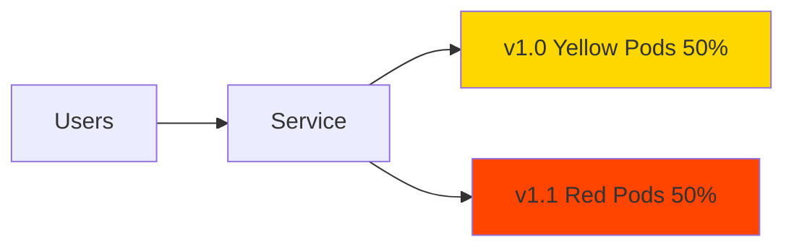

# Canary Deployments

Canary 배포는 새 버전을 소수의 사용자에게 먼저 배포하여 테스트한 후, 점진적으로 모든 사용자에게 확대하는 배포 전략입니다.

## Canary 배포란?

Canary 배포 전략의 핵심 개념:

* **점진적 롤아웃**: 새 버전을 일부 트래픽에만 먼저 노출
* **리스크 최소화**: 문제 발생 시 영향 범위 제한
* **실시간 검증**: 프로덕션 환경에서 실제 사용자 트래픽으로 테스트
* **A/B 테스트**: 두 버전의 성능과 사용자 반응 비교

이름의 유래: 광부들이 유독 가스를 감지하기 위해 카나리아(canary) 새를 탄광에 데려간 것에서 유래

## 작동 원리

### 초기 상태 (v1.0 100%)


### Canary 배포 (v1.0 50% + v1.1 50%)



## Kubernetes에서 Canary 배포

Kubernetes에서는 동일한 label selector를 가진 여러 Deployment를 사용하여 Canary 배포를 구현합니다.

### 1. 기존 버전 (v1.0)

```yaml title="canary-1-dep.yaml"
apiVersion: apps/v1
kind: Deployment
metadata:
  name: canary-1-dep
spec:
  replicas: 3
  selector:
    matchLabels:
      target: canary-pod
  template:
    metadata:
      labels:
        target: canary-pod  # Service selector와 매칭
        version: "1.0"
        color: yellow
    spec:
      nodeSelector:
        kubernetes.io/os: linux
      containers:
        - name: servicedemo
          image: scubakiz/servicedemo:1.0
          ports:
            - containerPort: 80
              protocol: TCP
          imagePullPolicy: Always
          env:
            - name: IMAGE_COLOR
              value: yellow
            - name: NODE_IP
              valueFrom:
                fieldRef:
                  fieldPath: status.hostIP
            - name: NODE_NAME
              valueFrom:
                fieldRef:
                  fieldPath: spec.nodeName
            - name: POD_IP
              valueFrom:
                fieldRef:
                  fieldPath: status.podIP
            - name: POD_NAME
              valueFrom:
                fieldRef:
                  fieldPath: metadata.name
            - name: POD_NAMESPACE
              valueFrom:
                fieldRef:
                  fieldPath: metadata.namespace
```

### 2. Service

```yaml title="canary-svc.yaml"
apiVersion: v1
kind: Service
metadata:
  name: canary-svc
spec:
  ports:
    - name: web
      port: 8080
      targetPort: 80
  selector:
    target: canary-pod  # 두 Deployment 모두 선택
  type: LoadBalancer
```

### 3. 새 버전 (v1.1 - Canary)

```yaml title="canary-2-dep.yaml"
apiVersion: apps/v1
kind: Deployment
metadata:
  name: canary-2-dep
spec:
  replicas: 3
  selector:
    matchLabels:
      target: canary-pod
  template:
    metadata:
      labels:
        target: canary-pod  # Service selector와 매칭 (동일)
        version: "1.1"
        color: red
    spec:
      nodeSelector:
        kubernetes.io/os: linux
      containers:
        - name: servicedemo
          image: scubakiz/servicedemo:1.0
          ports:
            - containerPort: 80
              protocol: TCP
          imagePullPolicy: Always
          env:
            - name: IMAGE_COLOR
              value: red  # 새 버전 표시
            - name: NODE_IP
              valueFrom:
                fieldRef:
                  fieldPath: status.hostIP
            - name: NODE_NAME
              valueFrom:
                fieldRef:
                  fieldPath: spec.nodeName
            - name: POD_IP
              valueFrom:
                fieldRef:
                  fieldPath: status.podIP
            - name: POD_NAME
              valueFrom:
                fieldRef:
                  fieldPath: metadata.name
            - name: POD_NAMESPACE
              valueFrom:
                fieldRef:
                  fieldPath: metadata.namespace
```

## 단계별 Canary 배포 실습

### 1단계: 기존 버전 배포 (v1.0)

```bash
# v1.0 Deployment 생성
kubectl apply -f canary-1-dep.yaml

# Service 생성
kubectl apply -f canary-svc.yaml

# Pod 상태 확인
kubectl get pods -l target=canary-pod

# Service 확인
kubectl get service canary-svc

# LoadBalancer IP 대기
kubectl get service canary-svc --watch
# Ctrl+C로 중지

# 외부 IP 가져오기
EXTERNAL_IP=$(kubectl get service canary-svc -o jsonpath='{.status.loadBalancer.ingress[0].ip}')
echo "Canary Service URL: http://$EXTERNAL_IP:8080"
```

### 2단계: 트래픽 확인 (100% v1.0)

```bash
# 반복 호출하여 Yellow만 나오는지 확인
for i in {1..20}; do
  curl -s http://$EXTERNAL_IP:8080 | grep -i "color\|version"
  sleep 0.5
done
```

### 3단계: Canary 버전 배포 (v1.1)

```bash
# Canary Deployment 생성
kubectl apply -f canary-2-dep.yaml

# Pod 상태 확인 (두 Deployment의 Pod 모두 존재)
kubectl get pods -l target=canary-pod -L version,color

# Endpoint 확인 (Service가 두 Deployment의 Pod 모두 선택)
kubectl get endpoints canary-svc
```

### 4단계: 트래픽 분산 확인

```bash
# Service가 두 Deployment로 트래픽 분산
# 약 50:50 비율로 Yellow와 Red가 나타남
for i in {1..20}; do
  echo -n "$i: "
  curl -s http://$EXTERNAL_IP:8080 | grep -o "Yellow\|Red" || echo "Error"
  sleep 0.5
done

# 통계 확인
echo "=== Traffic Distribution ==="
for i in {1..100}; do
  curl -s http://$EXTERNAL_IP:8080
done | grep -o "Yellow\|Red" | sort | uniq -c
```

출력 예:
```
=== Traffic Distribution ===
  52 Red
  48 Yellow
```

### 5단계: Canary 분석 및 결정

```bash
# Pod 메트릭 확인
kubectl top pods -l target=canary-pod

# 로그 확인
kubectl logs -l version="1.1" --tail=50

# Canary가 성공적이면 다음 단계로 진행
# 문제가 있으면 Canary 제거
```

## 트래픽 비율 조정

replicas를 조정하여 트래픽 비율 변경:

### 예제 1: 10% Canary

```bash
# v1.0: 9 replicas (90%)
kubectl scale deployment canary-1-dep --replicas=9

# v1.1: 1 replica (10%)
kubectl scale deployment canary-2-dep --replicas=1

# 확인
kubectl get pods -l target=canary-pod -L version

# 트래픽 분산 확인
for i in {1..100}; do
  curl -s http://$EXTERNAL_IP:8080
done | grep -o "Yellow\|Red" | sort | uniq -c
```

### 예제 2: 25% Canary

```bash
# v1.0: 3 replicas (75%)
kubectl scale deployment canary-1-dep --replicas=3

# v1.1: 1 replica (25%)
kubectl scale deployment canary-2-dep --replicas=1

# 확인
kubectl get pods -l target=canary-pod -L version
```

### 예제 3: 점진적 증가

```bash
# 1단계: 10% Canary
kubectl scale deployment canary-1-dep --replicas=9
kubectl scale deployment canary-2-dep --replicas=1
echo "10% Canary - Monitoring..."
sleep 300  # 5분 모니터링

# 2단계: 25% Canary
kubectl scale deployment canary-1-dep --replicas=3
kubectl scale deployment canary-2-dep --replicas=1
echo "25% Canary - Monitoring..."
sleep 300

# 3단계: 50% Canary
kubectl scale deployment canary-1-dep --replicas=3
kubectl scale deployment canary-2-dep --replicas=3
echo "50% Canary - Monitoring..."
sleep 300

# 4단계: 100% Canary (완전 전환)
kubectl scale deployment canary-1-dep --replicas=0
kubectl scale deployment canary-2-dep --replicas=6
echo "100% Canary - Complete!"
```

## 모니터링 및 검증

### 1. 실시간 트래픽 모니터링

```bash
#!/bin/bash
# canary-monitor.sh

EXTERNAL_IP=$(kubectl get service canary-svc -o jsonpath='{.status.loadBalancer.ingress[0].ip}')
YELLOW_COUNT=0
RED_COUNT=0
TOTAL=100

echo "=== Canary Traffic Monitor ==="
echo "Testing $TOTAL requests..."

for i in $(seq 1 $TOTAL); do
  COLOR=$(curl -s http://$EXTERNAL_IP:8080 | grep -o "Yellow\|Red")
  if [ "$COLOR" = "Yellow" ]; then
    ((YELLOW_COUNT++))
  elif [ "$COLOR" = "Red" ]; then
    ((RED_COUNT++))
  fi
  printf "\rProgress: %d/%d | Yellow: %d (%.0f%%) | Red: %d (%.0f%%)" \
    $i $TOTAL $YELLOW_COUNT $((YELLOW_COUNT * 100 / i)) $RED_COUNT $((RED_COUNT * 100 / i))
  sleep 0.1
done

echo ""
echo "=== Final Results ==="
echo "Yellow (v1.0): $YELLOW_COUNT requests ($(echo "scale=1; $YELLOW_COUNT * 100 / $TOTAL" | bc)%)"
echo "Red (v1.1): $RED_COUNT requests ($(echo "scale=1; $RED_COUNT * 100 / $TOTAL" | bc)%)"
```

### 2. 에러율 모니터링

```bash
# 각 버전의 에러 로그 확인
echo "=== v1.0 Errors ==="
kubectl logs -l version="1.0" --tail=100 | grep -i error | wc -l

echo "=== v1.1 Errors ==="
kubectl logs -l version="1.1" --tail=100 | grep -i error | wc -l
```

### 3. 응답 시간 비교

```bash
# v1.0 응답 시간
echo "=== v1.0 Response Time ==="
for i in {1..10}; do
  POD=$(kubectl get pod -l version="1.0" -o jsonpath='{.items[0].metadata.name}')
  kubectl exec $POD -- time -f "%E" curl -s http://localhost > /dev/null
done

# v1.1 응답 시간
echo "=== v1.1 Response Time ==="
for i in {1..10}; do
  POD=$(kubectl get pod -l version="1.1" -o jsonpath='{.items[0].metadata.name}')
  kubectl exec $POD -- time -f "%E" curl -s http://localhost > /dev/null
done
```

## Canary 롤백

문제가 발견되면 즉시 Canary 제거:

```bash
# Canary Deployment 제거
kubectl delete deployment canary-2-dep

# v1.0으로 복원
kubectl scale deployment canary-1-dep --replicas=3

# 확인
kubectl get pods -l target=canary-pod
kubectl get endpoints canary-svc

# 트래픽 확인 (100% Yellow)
for i in {1..10}; do
  curl -s http://$EXTERNAL_IP:8080 | grep -o "Yellow\|Red"
done
```

## Canary 완전 전환

Canary가 성공적이면 완전히 전환:

```bash
# v1.0 제거
kubectl delete deployment canary-1-dep

# v1.1을 주 버전으로 승격
kubectl scale deployment canary-2-dep --replicas=3

# 확인
kubectl get deployments
kubectl get pods -l target=canary-pod

# 트래픽 확인 (100% Red)
for i in {1..10}; do
  curl -s http://$EXTERNAL_IP:8080 | grep -o "Yellow\|Red"
done
```

## Canary 배포의 장단점

### 장점

* ✅ **점진적 롤아웃**: 리스크를 단계적으로 관리
* ✅ **실시간 검증**: 프로덕션 환경에서 실제 사용자로 테스트
* ✅ **빠른 롤백**: 문제 발견 시 즉시 중단
* ✅ **A/B 테스트**: 두 버전의 성능 비교 가능

### 단점

* ❌ **트래픽 제어 제한**: Pod 개수로만 비율 조정 (정확한 % 어려움)
* ❌ **세션 일관성**: 사용자가 여러 버전을 경험할 수 있음
* ❌ **복잡성**: Blue-Green보다 관리 복잡
* ❌ **추가 리소스**: 두 버전이 동시에 실행

## Service Mesh를 사용한 정교한 Canary

기본 Kubernetes Service는 정확한 트래픽 비율 제어가 어렵습니다. 더 정교한 제어를 위해서는 Service Mesh 사용을 고려하세요:

### Istio를 사용한 Canary 예제

```yaml
# 정확한 트래픽 비율 제어
apiVersion: networking.istio.io/v1beta1
kind: VirtualService
metadata:
  name: canary-vs
spec:
  hosts:
    - canary-svc
  http:
    - match:
        - headers:
            user-group:
              exact: beta-testers
      route:
        - destination:
            host: canary-svc
            subset: v1.1
          weight: 100
    - route:
        - destination:
            host: canary-svc
            subset: v1.0
          weight: 90  # 90% to v1.0
        - destination:
            host: canary-svc
            subset: v1.1
          weight: 10  # 10% to v1.1
```

## 자동화 스크립트

```bash title="canary-deploy.sh"
#!/bin/bash

set -e

STABLE_DEP="canary-1-dep"
CANARY_DEP="canary-2-dep"
SERVICE="canary-svc"
EXTERNAL_IP=$(kubectl get service $SERVICE -o jsonpath='{.status.loadBalancer.ingress[0].ip}')

# 트래픽 분산 확인 함수
check_traffic_distribution() {
  local sample_size=$1
  local yellow=0
  local red=0
  
  echo "Checking traffic distribution (sample: $sample_size)..."
  for i in $(seq 1 $sample_size); do
    color=$(curl -s http://$EXTERNAL_IP:8080 | grep -o "Yellow\|Red")
    if [ "$color" = "Yellow" ]; then
      ((yellow++))
    else
      ((red++))
    fi
  done
  
  local yellow_pct=$((yellow * 100 / sample_size))
  local red_pct=$((red * 100 / sample_size))
  
  echo "Yellow (Stable): $yellow ($yellow_pct%)"
  echo "Red (Canary): $red ($red_pct%)"
  
  return 0
}

# 1. Canary 배포
echo "=== Step 1: Deploy Canary ==="
kubectl apply -f canary-2-dep.yaml
kubectl wait --for=condition=ready pod -l target=canary-pod,version="1.1" --timeout=300s

# 2. 10% Canary
echo "=== Step 2: 10% Canary Traffic ==="
kubectl scale deployment $STABLE_DEP --replicas=9
kubectl scale deployment $CANARY_DEP --replicas=1
sleep 30
check_traffic_distribution 100

read -p "Continue to 50%? (y/n) " -n 1 -r
echo
if [[ ! $REPLY =~ ^[Yy]$ ]]; then
  echo "Aborting. Rolling back..."
  kubectl delete deployment $CANARY_DEP
  kubectl scale deployment $STABLE_DEP --replicas=3
  exit 1
fi

# 3. 50% Canary
echo "=== Step 3: 50% Canary Traffic ==="
kubectl scale deployment $STABLE_DEP --replicas=3
kubectl scale deployment $CANARY_DEP --replicas=3
sleep 30
check_traffic_distribution 100

read -p "Continue to 100%? (y/n) " -n 1 -r
echo
if [[ ! $REPLY =~ ^[Yy]$ ]]; then
  echo "Aborting. Rolling back..."
  kubectl delete deployment $CANARY_DEP
  kubectl scale deployment $STABLE_DEP --replicas=3
  exit 1
fi

# 4. 100% Canary
echo "=== Step 4: 100% Canary Traffic ==="
kubectl scale deployment $STABLE_DEP --replicas=0
kubectl scale deployment $CANARY_DEP --replicas=6
sleep 30
check_traffic_distribution 50

# 5. 정리
echo "=== Step 5: Cleanup Old Version ==="
kubectl delete deployment $STABLE_DEP

echo "✅ Canary deployment complete!"
```

사용 방법:

```bash
chmod +x canary-deploy.sh
./canary-deploy.sh
```

## 리소스 정리

```bash
kubectl delete deployment canary-1-dep canary-2-dep
kubectl delete service canary-svc
```

## 실습 과제

:::tip 실습 과제
1. 기존 버전(Yellow)을 배포하고 LoadBalancer로 접근하세요
2. Canary 버전(Red)을 배포하고 트래픽 분산을 확인하세요
3. replicas를 조정하여 10%, 25%, 50%로 트래픽 비율을 변경하세요
4. 트래픽 분산을 모니터링하는 스크립트를 작성하세요
5. Canary를 완전히 전환하고 이전 버전을 제거하세요
6. Canary 롤백 시나리오를 실습하세요
7. 자동화 스크립트를 작성하여 단계별 Canary 배포를 자동화하세요
:::

## 관련 학습 자료

* [Blue-Green Deployments](./blue-green-deployments): 즉시 전환 전략
* [Services](./services): Kubernetes Service 이해
* Istio를 사용한 고급 트래픽 관리 (추후 학습)

## 다음 단계

더 고급 배포 전략을 학습하려면 Service Mesh (Istio) 섹션을 참고하세요.
