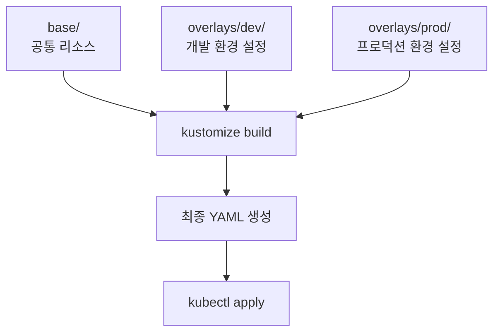

# Kustomize

Kustomize는 Kubernetes 리소스를 선언적으로 관리하고 환경별(개발, 스테이징, 프로덕션) 설정을 재사용 가능하게 만드는 도구입니다. kubectl에 내장되어 있어 별도 설치 없이 사용할 수 있습니다.

## Kustomize의 필요성

### 기존 방식의 문제점

환경별로 다른 설정이 필요한 경우:
- ❌ 각 환경마다 별도의 YAML 파일 관리
- ❌ 코드 중복으로 유지보수 어려움
- ❌ 변경 사항 동기화 누락 위험
- ❌ 환경별 차이점 파악 어려움

### Kustomize의 장점

- ✅ 기본 설정을 재사용하고 환경별 차이만 오버레이
- ✅ YAML 템플릿 엔진 불필요 (순수 YAML 유지)
- ✅ kubectl에 내장되어 별도 도구 설치 불필요
- ✅ Git으로 버전 관리 용이
- ✅ 선언적이고 예측 가능한 설정 관리

## Kustomize 아키텍처



## 실습 1: 기본 구조 만들기

### 디렉토리 구조

```bash
# 프로젝트 디렉토리 생성
mkdir -p ~/kustomize-demo/{base,overlays/{dev,prod}}
cd ~/kustomize-demo

# 디렉토리 구조 확인
tree
```

**예상 구조**:
```
kustomize-demo/
├── base/
│   ├── kustomization.yaml
│   ├── deployment.yaml
│   └── service.yaml
└── overlays/
    ├── dev/
    │   ├── kustomization.yaml
    │   └── replica-patch.yaml
    └── prod/
        ├── kustomization.yaml
        └── replica-patch.yaml
```

### Base 리소스 생성

**1. Base Deployment 생성**:
```bash
cat <<EOF > base/deployment.yaml
apiVersion: apps/v1
kind: Deployment
metadata:
  name: myapp
  labels:
    app: myapp
spec:
  replicas: 1
  selector:
    matchLabels:
      app: myapp
  template:
    metadata:
      labels:
        app: myapp
    spec:
      containers:
      - name: myapp
        image: nginx:1.25
        ports:
        - containerPort: 80
        resources:
          requests:
            cpu: 100m
            memory: 128Mi
          limits:
            cpu: 200m
            memory: 256Mi
EOF
```

**2. Base Service 생성**:
```bash
cat <<EOF > base/service.yaml
apiVersion: v1
kind: Service
metadata:
  name: myapp
  labels:
    app: myapp
spec:
  type: ClusterIP
  ports:
  - port: 80
    targetPort: 80
    protocol: TCP
  selector:
    app: myapp
EOF
```

**3. Base Kustomization 생성**:
```bash
cat <<EOF > base/kustomization.yaml
apiVersion: kustomize.config.k8s.io/v1beta1
kind: Kustomization

resources:
  - deployment.yaml
  - service.yaml

commonLabels:
  managed-by: kustomize
EOF
```

**4. Base 설정 확인**:
```bash
# Base 리소스 빌드 확인
kubectl kustomize base/
```

## 실습 2: 개발 환경 오버레이

### Dev 환경 설정

**1. Dev 환경용 패치 생성**:
```bash
cat <<EOF > overlays/dev/replica-patch.yaml
apiVersion: apps/v1
kind: Deployment
metadata:
  name: myapp
spec:
  replicas: 2
EOF
```

**2. Dev Kustomization 생성**:
```bash
cat <<EOF > overlays/dev/kustomization.yaml
apiVersion: kustomize.config.k8s.io/v1beta1
kind: Kustomization

namespace: dev

namePrefix: dev-

commonLabels:
  environment: dev

bases:
  - ../../base

patches:
  - replica-patch.yaml

images:
  - name: nginx
    newTag: 1.25-alpine
EOF
```

**3. Dev 환경 빌드 확인**:
```bash
# Dev 환경 리소스 확인
kubectl kustomize overlays/dev/
```

**4. Dev 환경 배포**:
```bash
# 네임스페이스 생성
kubectl create namespace dev

# Dev 환경 배포
kubectl apply -k overlays/dev/

# 확인
kubectl get all -n dev
kubectl get deployment dev-myapp -n dev -o yaml | grep -A 2 replicas
```

## 실습 3: 프로덕션 환경 오버레이

### Prod 환경 설정

**1. Prod 환경용 패치 생성**:
```bash
cat <<EOF > overlays/prod/replica-patch.yaml
apiVersion: apps/v1
kind: Deployment
metadata:
  name: myapp
spec:
  replicas: 5
  template:
    spec:
      containers:
      - name: myapp
        resources:
          requests:
            cpu: 200m
            memory: 256Mi
          limits:
            cpu: 500m
            memory: 512Mi
EOF
```

**2. Prod Service 패치 생성**:
```bash
cat <<EOF > overlays/prod/service-patch.yaml
apiVersion: v1
kind: Service
metadata:
  name: myapp
spec:
  type: LoadBalancer
EOF
```

**3. Prod Kustomization 생성**:
```bash
cat <<EOF > overlays/prod/kustomization.yaml
apiVersion: kustomize.config.k8s.io/v1beta1
kind: Kustomization

namespace: prod

namePrefix: prod-

commonLabels:
  environment: prod
  tier: production

bases:
  - ../../base

patches:
  - replica-patch.yaml
  - service-patch.yaml

images:
  - name: nginx
    newTag: 1.25

commonAnnotations:
  managed-by: kustomize
  environment: production
EOF
```

**4. Prod 환경 빌드 확인**:
```bash
# Prod 환경 리소스 확인
kubectl kustomize overlays/prod/
```

**5. Prod 환경 배포**:
```bash
# 네임스페이스 생성
kubectl create namespace prod

# Prod 환경 배포
kubectl apply -k overlays/prod/

# 확인
kubectl get all -n prod
kubectl get deployment prod-myapp -n prod -o yaml | grep -A 2 replicas
kubectl get svc prod-myapp -n prod
```

## 실습 4: ConfigMap 생성기

### ConfigMap Generator 사용

**1. Base에 ConfigMap 추가**:
```bash
cat <<EOF >> base/kustomization.yaml

configMapGenerator:
  - name: app-config
    literals:
      - APP_NAME=myapp
      - LOG_LEVEL=info
EOF
```

**2. Dev 환경에서 ConfigMap 오버라이드**:
```bash
cat <<EOF >> overlays/dev/kustomization.yaml

configMapGenerator:
  - name: app-config
    behavior: merge
    literals:
      - LOG_LEVEL=debug
      - ENVIRONMENT=development
EOF
```

**3. Prod 환경에서 ConfigMap 오버라이드**:
```bash
cat <<EOF >> overlays/prod/kustomization.yaml

configMapGenerator:
  - name: app-config
    behavior: merge
    literals:
      - LOG_LEVEL=warn
      - ENVIRONMENT=production
EOF
```

**4. Deployment에서 ConfigMap 사용**:
```bash
cat <<EOF > base/deployment.yaml
apiVersion: apps/v1
kind: Deployment
metadata:
  name: myapp
  labels:
    app: myapp
spec:
  replicas: 1
  selector:
    matchLabels:
      app: myapp
  template:
    metadata:
      labels:
        app: myapp
    spec:
      containers:
      - name: myapp
        image: nginx:1.25
        ports:
        - containerPort: 80
        envFrom:
        - configMapRef:
            name: app-config
        resources:
          requests:
            cpu: 100m
            memory: 128Mi
          limits:
            cpu: 200m
            memory: 256Mi
EOF
```

**5. ConfigMap 확인**:
```bash
# Dev 환경 ConfigMap
kubectl kustomize overlays/dev/ | grep -A 10 "kind: ConfigMap"

# Prod 환경 ConfigMap
kubectl kustomize overlays/prod/ | grep -A 10 "kind: ConfigMap"
```

**6. 재배포**:
```bash
# Dev 환경 재배포
kubectl apply -k overlays/dev/

# Prod 환경 재배포
kubectl apply -k overlays/prod/

# ConfigMap 확인
kubectl get configmap -n dev
kubectl describe configmap -n dev | grep -A 5 Data

kubectl get configmap -n prod
kubectl describe configmap -n prod | grep -A 5 Data
```

## 실습 5: Secret 생성기

### Secret Generator 사용

**1. Secret 파일 생성**:
```bash
# Dev 환경 시크릿
cat <<EOF > overlays/dev/secret.env
DB_PASSWORD=dev-password-123
API_KEY=dev-api-key-456
EOF

# Prod 환경 시크릿
cat <<EOF > overlays/prod/secret.env
DB_PASSWORD=prod-secure-password-xyz
API_KEY=prod-api-key-abc
EOF
```

**2. Dev Kustomization에 Secret Generator 추가**:
```bash
cat <<EOF >> overlays/dev/kustomization.yaml

secretGenerator:
  - name: app-secrets
    envs:
      - secret.env
EOF
```

**3. Prod Kustomization에 Secret Generator 추가**:
```bash
cat <<EOF >> overlays/prod/kustomization.yaml

secretGenerator:
  - name: app-secrets
    envs:
      - secret.env
EOF
```

**4. Deployment에서 Secret 사용**:
```bash
# Base Deployment 수정 (envFrom 섹션에 추가)
cat <<EOF > base/deployment.yaml
apiVersion: apps/v1
kind: Deployment
metadata:
  name: myapp
  labels:
    app: myapp
spec:
  replicas: 1
  selector:
    matchLabels:
      app: myapp
  template:
    metadata:
      labels:
        app: myapp
    spec:
      containers:
      - name: myapp
        image: nginx:1.25
        ports:
        - containerPort: 80
        envFrom:
        - configMapRef:
            name: app-config
        - secretRef:
            name: app-secrets
        resources:
          requests:
            cpu: 100m
            memory: 128Mi
          limits:
            cpu: 200m
            memory: 256Mi
EOF
```

**5. Secret 배포 및 확인**:
```bash
# Dev 환경 배포
kubectl apply -k overlays/dev/

# Secret 확인 (해시 접미사 자동 생성됨)
kubectl get secrets -n dev
kubectl get deployment dev-myapp -n dev -o yaml | grep -A 5 envFrom

# Prod 환경 배포
kubectl apply -k overlays/prod/

# Secret 확인
kubectl get secrets -n prod
kubectl get deployment prod-myapp -n prod -o yaml | grep -A 5 envFrom
```

**Secret 값 확인 (디코딩)**:
```bash
# Dev 환경 시크릿 확인
SECRET_NAME=$(kubectl get secrets -n dev | grep app-secrets | awk '{print $1}')
kubectl get secret $SECRET_NAME -n dev -o jsonpath='{.data.DB_PASSWORD}' | base64 -d
echo

# Prod 환경 시크릿 확인
SECRET_NAME=$(kubectl get secrets -n prod | grep app-secrets | awk '{print $1}')
kubectl get secret $SECRET_NAME -n prod -o jsonpath='{.data.DB_PASSWORD}' | base64 -d
echo
```

## 실습 6: JSON 6902 패치

### 복잡한 패치 적용

**1. JSON 패치 파일 생성**:
```bash
cat <<EOF > overlays/prod/add-probe.yaml
- op: add
  path: /spec/template/spec/containers/0/livenessProbe
  value:
    httpGet:
      path: /healthz
      port: 80
    initialDelaySeconds: 30
    periodSeconds: 10

- op: add
  path: /spec/template/spec/containers/0/readinessProbe
  value:
    httpGet:
      path: /ready
      port: 80
    initialDelaySeconds: 5
    periodSeconds: 5
EOF
```

**2. Prod Kustomization 수정**:
```bash
cat <<EOF > overlays/prod/kustomization.yaml
apiVersion: kustomize.config.k8s.io/v1beta1
kind: Kustomization

namespace: prod

namePrefix: prod-

commonLabels:
  environment: prod
  tier: production

bases:
  - ../../base

patches:
  - replica-patch.yaml
  - service-patch.yaml

patchesJson6902:
  - target:
      group: apps
      version: v1
      kind: Deployment
      name: myapp
    path: add-probe.yaml

images:
  - name: nginx
    newTag: 1.25

commonAnnotations:
  managed-by: kustomize
  environment: production

configMapGenerator:
  - name: app-config
    behavior: merge
    literals:
      - LOG_LEVEL=warn
      - ENVIRONMENT=production

secretGenerator:
  - name: app-secrets
    envs:
      - secret.env
EOF
```

**3. 패치 적용 확인**:
```bash
# 빌드하여 Probe 추가 확인
kubectl kustomize overlays/prod/ | grep -A 10 "livenessProbe"

# 배포
kubectl apply -k overlays/prod/

# Probe 확인
kubectl get deployment prod-myapp -n prod -o yaml | grep -A 15 Probe
```

## 실습 7: 리소스 변환기

### 이미지와 레이블 일괄 변경

**1. 모든 환경의 이미지 태그 변경**:
```bash
# Prod 환경 이미지 태그 업데이트
cat <<EOF > overlays/prod/kustomization.yaml
apiVersion: kustomize.config.k8s.io/v1beta1
kind: Kustomization

namespace: prod

namePrefix: prod-

commonLabels:
  environment: prod
  tier: production
  version: v2

bases:
  - ../../base

patches:
  - replica-patch.yaml
  - service-patch.yaml

patchesJson6902:
  - target:
      group: apps
      version: v1
      kind: Deployment
      name: myapp
    path: add-probe.yaml

images:
  - name: nginx
    newName: nginx
    newTag: 1.26-alpine

commonAnnotations:
  managed-by: kustomize
  environment: production
  version: "2.0"

configMapGenerator:
  - name: app-config
    behavior: merge
    literals:
      - LOG_LEVEL=warn
      - ENVIRONMENT=production
      - VERSION=2.0

secretGenerator:
  - name: app-secrets
    envs:
      - secret.env
EOF
```

**2. 변경사항 확인 및 배포**:
```bash
# 변경사항 미리보기
kubectl diff -k overlays/prod/

# 배포
kubectl apply -k overlays/prod/

# 이미지 확인
kubectl get deployment prod-myapp -n prod -o yaml | grep image:

# 레이블 확인
kubectl get deployment prod-myapp -n prod --show-labels
```

## 주요 Kustomize 기능

### 1. 네임 변환

| 필드 | 설명 | 예시 |
|------|------|------|
| `namePrefix` | 모든 리소스 이름 앞에 접두사 추가 | `dev-`, `prod-` |
| `nameSuffix` | 모든 리소스 이름 뒤에 접미사 추가 | `-v1`, `-canary` |
| `namespace` | 모든 리소스에 네임스페이스 설정 | `dev`, `prod` |

### 2. 레이블과 어노테이션

```yaml
commonLabels:
  app: myapp
  managed-by: kustomize
  
commonAnnotations:
  description: "Managed by Kustomize"
```

### 3. 패치 방식

| 패치 방식 | 용도 | 복잡도 |
|----------|------|--------|
| Strategic Merge | 간단한 필드 오버라이드 | 낮음 |
| JSON 6902 | 정밀한 수정 (추가/삭제/변경) | 높음 |
| Inline | Kustomization 파일 내 직접 정의 | 중간 |

### 4. 생성기

```yaml
# ConfigMap 생성
configMapGenerator:
  - name: config
    literals:
      - KEY=value
    files:
      - config.properties

# Secret 생성
secretGenerator:
  - name: secrets
    envs:
      - secret.env
    files:
      - tls.crt
      - tls.key
```

## 고급 패턴

### Components 사용

**1. Components 디렉토리 생성**:
```bash
mkdir -p components/monitoring
```

**2. Monitoring Component 생성**:
```bash
cat <<EOF > components/monitoring/kustomization.yaml
apiVersion: kustomize.config.k8s.io/v1alpha1
kind: Component

commonLabels:
  monitoring: enabled

patches:
  - target:
      kind: Deployment
    patch: |-
      - op: add
        path: /spec/template/metadata/annotations/prometheus.io~1scrape
        value: "true"
      - op: add
        path: /spec/template/metadata/annotations/prometheus.io~1port
        value: "9090"
EOF
```

**3. Prod 환경에서 Component 사용**:
```bash
cat <<EOF >> overlays/prod/kustomization.yaml

components:
  - ../../components/monitoring
EOF
```

**4. Component 적용 확인**:
```bash
kubectl kustomize overlays/prod/ | grep -A 5 annotations
```

## 검증 및 테스트

### Kustomize 빌드 검증

```bash
# 문법 검증
kubectl kustomize overlays/dev/ > /dev/null && echo "✅ Dev 설정 유효함"
kubectl kustomize overlays/prod/ > /dev/null && echo "✅ Prod 설정 유효함"

# 차이점 비교
diff <(kubectl kustomize overlays/dev/) <(kubectl kustomize overlays/prod/) | head -20

# 특정 리소스만 추출
kubectl kustomize overlays/prod/ | grep -A 20 "kind: Deployment"
```

### Dry-run 테스트

```bash
# Dry-run으로 배포 테스트
kubectl apply -k overlays/dev/ --dry-run=client

# Server-side dry-run
kubectl apply -k overlays/prod/ --dry-run=server
```

## 정리

```bash
# 모든 리소스 삭제
kubectl delete -k overlays/dev/
kubectl delete -k overlays/prod/

# 네임스페이스 삭제
kubectl delete namespace dev prod

# 작업 디렉토리 정리
cd ~
rm -rf ~/kustomize-demo
```

## 베스트 프랙티스

### 1. 디렉토리 구조

```
project/
├── base/               # 공통 리소스
│   ├── kustomization.yaml
│   └── *.yaml
├── overlays/          # 환경별 설정
│   ├── dev/
│   ├── staging/
│   └── prod/
└── components/        # 재사용 가능한 컴포넌트
    ├── monitoring/
    └── security/
```

### 2. Base 최소화

- Base에는 모든 환경에 공통인 설정만 포함
- 환경별 차이는 Overlay에서만 정의
- 기본값은 가장 제한적으로 설정

### 3. ConfigMap/Secret 관리

- 민감 정보는 `.gitignore`에 추가
- Secret은 외부 시크릿 관리 도구 사용 권장
- ConfigMap Generator로 해시 접미사 자동 생성

### 4. 버전 관리

```yaml
# 이미지 태그 명시
images:
  - name: myapp
    newTag: v1.2.3  # latest 대신 특정 버전 사용
```

### 5. 검증 자동화

```bash
# CI/CD에서 Kustomize 검증
kustomize build overlays/prod/ | kubeval --strict
```

### 6. 문서화

```yaml
# kustomization.yaml에 주석 추가
apiVersion: kustomize.config.k8s.io/v1beta1
kind: Kustomization

# 이 설정은 프로덕션 환경용입니다
# 복제본: 5, 리소스: 높음, 모니터링: 활성화
```

## 문제 해결

### 일반적인 오류

**1. 리소스를 찾을 수 없음**:
```bash
# bases 경로 확인
cat overlays/dev/kustomization.yaml | grep bases

# 상대 경로가 올바른지 확인
ls -la ../../base
```

**2. 패치가 적용되지 않음**:
```bash
# 패치 대상 이름 확인
kubectl kustomize overlays/prod/ | grep "name: myapp"

# namePrefix/nameSuffix 고려
```

**3. ConfigMap/Secret 해시 불일치**:
```bash
# 해시는 내용이 변경될 때마다 변경됨
# 이전 ConfigMap/Secret 삭제 후 재배포
kubectl delete configmap -n dev --all
kubectl apply -k overlays/dev/
```

### 디버깅 팁

```bash
# 상세 출력
kubectl kustomize overlays/prod/ --enable-alpha-plugins

# 특정 리소스만 확인
kubectl kustomize overlays/prod/ | yq eval 'select(.kind == "Deployment")'

# JSON 형식으로 출력
kubectl kustomize overlays/prod/ -o json | jq
```

## 추가 학습 자료

- [Kustomize 공식 문서](https://kustomize.io/)
- [Kubernetes 문서 - Kustomize](https://kubernetes.io/docs/tasks/manage-kubernetes-objects/kustomization/)
- [Kustomize GitHub](https://github.com/kubernetes-sigs/kustomize)

## 다음 단계

- [Blue-Green 배포](./blue-green-deployments) - Kustomize로 배포 전략 구현
- [Canary 배포](./canary-deployments) - 점진적 배포 자동화
- [고급 Kubernetes](../advanced-kubernetes/intro) - Helm과 Kustomize 비교
