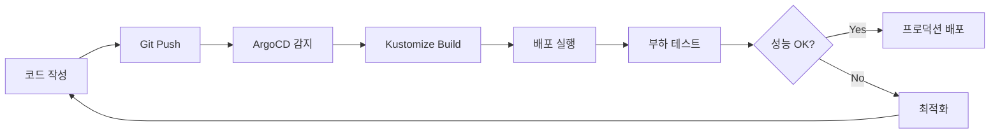

# 실전 Kubernetes 운영

실무 환경에서 Kubernetes를 효과적으로 운영하기 위한 핵심 도구와 기법을 학습합니다.

## 학습 목표

이 섹션에서는 다음 내용을 다룹니다:

### 1. Kustomize
- 환경별 구성 관리 (개발/스테이징/프로덕션)
- Base와 Overlay 패턴
- ConfigMap/Secret 관리
- GitOps 워크플로우 통합

### 2. ArgoCD
- GitOps 기반 지속적 배포
- 애플리케이션 동기화 및 관리
- Multi-cluster 배포
- 자동화 및 롤백 전략

### 3. 부하 테스트
- 다양한 부하 테스트 도구 (k6, Locust, JMeter, Apache Bench)
- 실전 부하 테스트 시나리오
- 성능 메트릭 수집 및 분석
- 병목 지점 식별 및 최적화

## 실전 워크플로우



## 왜 실전 운영이 중요한가?

### 1. 일관성 있는 배포
- Kustomize로 환경별 설정을 체계적으로 관리
- 수동 배포의 휴먼 에러 제거
- 재현 가능한 배포 프로세스

### 2. 자동화된 GitOps
- ArgoCD를 통한 Git 기반 배포 자동화
- 선언적 구성으로 투명한 배포 이력
- 신속한 롤백 및 복구

### 3. 성능 검증
- 배포 전 부하 테스트로 성능 검증
- 병목 지점 사전 파악
- 리소스 최적화를 통한 비용 절감

## 학습 순서

각 주제는 독립적으로 학습할 수 있지만, 다음 순서를 권장합니다:

1. **Kustomize**: 먼저 환경별 구성 관리 방법을 익힙니다
2. **ArgoCD**: Kustomize와 통합하여 GitOps 워크플로우를 구축합니다
3. **부하 테스트**: 배포된 애플리케이션의 성능을 검증하고 최적화합니다

## 실습 환경 준비

각 실습을 시작하기 전에 다음을 확인하세요:

```bash
# AKS 클러스터 연결 확인
kubectl cluster-info

# 네임스페이스 생성
kubectl create namespace production --dry-run=client -o yaml | kubectl apply -f -

# 리소스 확인
kubectl get nodes
kubectl top nodes
```

## 참고 자료

- [Kustomize 공식 문서](https://kustomize.io/)
- [ArgoCD 공식 문서](https://argo-cd.readthedocs.io/)
- [CNCF Landscape](https://landscape.cncf.io/)
- [Kubernetes Best Practices](https://kubernetes.io/docs/concepts/configuration/overview/)

---

다음 섹션에서는 각 도구를 상세히 다룹니다. 준비가 되면 시작하세요! 🚀
