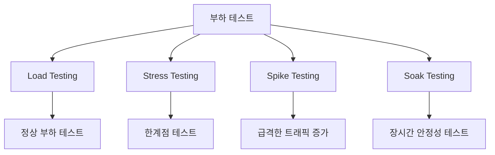
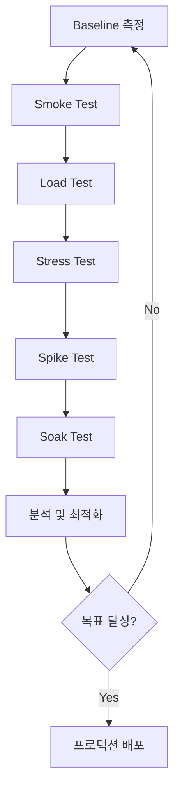

# Kubernetes 부하 테스트

프로덕션 배포 전 애플리케이션의 성능과 안정성을 검증하는 것은 필수입니다. 이 가이드에서는 다양한 부하 테스트 도구와 방법, 그리고 성능 최적화 기법을 다룹니다.

## 목차

- [부하 테스트란?](#부하-테스트란)
- [테스트 도구](#테스트-도구)
- [실전 부하 테스트](#실전-부하-테스트)
- [성능 메트릭 수집](#성능-메트릭-수집)
- [병목 지점 식별](#병목-지점-식별)
- [성능 최적화](#성능-최적화)
- [주의사항](#주의사항)
- [Best Practices](#best-practices)

---

## 부하 테스트란?

부하 테스트는 시스템이 예상되는 부하를 처리할 수 있는지 검증하는 프로세스입니다.

### 테스트 유형



| 테스트 유형 | 목적 | 지속 시간 | 부하 패턴 |
|------------|------|----------|----------|
| **Load Testing** | 정상 부하에서 성능 확인 | 10-30분 | 일정한 부하 |
| **Stress Testing** | 한계점 파악 | 30분-1시간 | 점진적 증가 |
| **Spike Testing** | 급격한 트래픽 대응 | 5-15분 | 급격한 증가/감소 |
| **Soak Testing** | 메모리 누수 등 장기 안정성 | 4-24시간 | 일정한 부하 |

### 왜 부하 테스트가 필요한가?

- ✅ **성능 병목 지점 사전 파악**
- ✅ **리소스 요구사항 정확한 측정**
- ✅ **Auto-scaling 동작 검증**
- ✅ **장애 상황 시뮬레이션**
- ✅ **SLA 준수 확인**

---

## 테스트 도구

### 1. Azure Load Testing (권장 - Azure 환경)

**특징**:
- Azure 네이티브 관리형 부하 테스트 서비스
- JMeter 기반 테스트 실행 (JMX 파일 지원)
- Azure Monitor와 자동 통합
- CI/CD 파이프라인 통합 (GitHub Actions, Azure DevOps)
- 대규모 분산 부하 생성 (최대 수백만 동시 사용자)
- Application Insights와 자동 연동
- 비용 효율적 (사용한 만큼만 과금)

**Azure Load Testing 리소스 생성**:

```bash
# Azure CLI로 리소스 그룹 생성 (기존 RG 사용 가능)
az group create --name aks-load-testing-rg --location koreacentral

# Azure Load Testing 리소스 생성
az load create \
  --name myLoadTest \
  --resource-group aks-load-testing-rg \
  --location koreacentral

# 리소스 확인
az load show \
  --name myLoadTest \
  --resource-group aks-load-testing-rg
```

**JMeter 테스트 스크립트 작성**:

```xml
<?xml version="1.0" encoding="UTF-8"?>
<!-- load-test.jmx -->
<jmeterTestPlan version="1.2" properties="5.0">
  <hashTree>
    <TestPlan guiclass="TestPlanGui" testclass="TestPlan" testname="AKS Load Test">
      <elementProp name="TestPlan.user_defined_variables" elementType="Arguments">
        <collectionProp name="Arguments.arguments">
          <elementProp name="TARGET_HOST" elementType="Argument">
            <stringProp name="Argument.name">TARGET_HOST</stringProp>
            <stringProp name="Argument.value">${__P(TARGET_HOST,myapp.example.com)}</stringProp>
          </elementProp>
          <elementProp name="THREADS" elementType="Argument">
            <stringProp name="Argument.name">THREADS</stringProp>
            <stringProp name="Argument.value">${__P(THREADS,100)}</stringProp>
          </elementProp>
          <elementProp name="RAMP_UP" elementType="Argument">
            <stringProp name="Argument.name">RAMP_UP</stringProp>
            <stringProp name="Argument.value">${__P(RAMP_UP,60)}</stringProp>
          </elementProp>
          <elementProp name="DURATION" elementType="Argument">
            <stringProp name="Argument.name">DURATION</stringProp>
            <stringProp name="Argument.value">${__P(DURATION,600)}</stringProp>
          </elementProp>
        </collectionProp>
      </elementProp>
    </TestPlan>
    <hashTree>
      <ThreadGroup guiclass="ThreadGroupGui" testclass="ThreadGroup" testname="Users">
        <intProp name="ThreadGroup.num_threads">${THREADS}</intProp>
        <intProp name="ThreadGroup.ramp_time">${RAMP_UP}</intProp>
        <longProp name="ThreadGroup.duration">${DURATION}</longProp>
        <boolProp name="ThreadGroup.scheduler">true</boolProp>
      </ThreadGroup>
      <hashTree>
        <HTTPSamplerProxy guiclass="HttpTestSampleGui" testclass="HTTPSamplerProxy" testname="Homepage">
          <stringProp name="HTTPSampler.domain">${TARGET_HOST}</stringProp>
          <stringProp name="HTTPSampler.path">/</stringProp>
          <stringProp name="HTTPSampler.method">GET</stringProp>
        </HTTPSamplerProxy>
        <hashTree>
          <ResponseAssertion guiclass="AssertionGui" testclass="ResponseAssertion" testname="Response Assertion">
            <collectionProp name="Asserion.test_strings">
              <stringProp name="49586">200</stringProp>
            </collectionProp>
            <stringProp name="Assertion.test_field">Assertion.response_code</stringProp>
          </ResponseAssertion>
        </hashTree>
        
        <HTTPSamplerProxy guiclass="HttpTestSampleGui" testclass="HTTPSamplerProxy" testname="API - Get Items">
          <stringProp name="HTTPSampler.domain">${TARGET_HOST}</stringProp>
          <stringProp name="HTTPSampler.path">/api/items</stringProp>
          <stringProp name="HTTPSampler.method">GET</stringProp>
        </HTTPSamplerProxy>
        <hashTree/>
        
        <HTTPSamplerProxy guiclass="HttpTestSampleGui" testclass="HTTPSamplerProxy" testname="API - Create Item">
          <stringProp name="HTTPSampler.domain">${TARGET_HOST}</stringProp>
          <stringProp name="HTTPSampler.path">/api/items</stringProp>
          <stringProp name="HTTPSampler.method">POST</stringProp>
          <boolProp name="HTTPSampler.postBodyRaw">true</boolProp>
          <elementProp name="HTTPsampler.Arguments" elementType="Arguments">
            <collectionProp name="Arguments.arguments">
              <elementProp name="" elementType="HTTPArgument">
                <boolProp name="HTTPArgument.always_encode">false</boolProp>
                <stringProp name="Argument.value">{"name":"Test Item","value":100}</stringProp>
              </elementProp>
            </collectionProp>
          </elementProp>
          <elementProp name="HTTPsampler.header_manager" elementType="HeaderManager">
            <collectionProp name="HeaderManager.headers">
              <elementProp name="" elementType="Header">
                <stringProp name="Header.name">Content-Type</stringProp>
                <stringProp name="Header.value">application/json</stringProp>
              </elementProp>
            </collectionProp>
          </elementProp>
        </HTTPSamplerProxy>
        <hashTree/>
        
        <ConstantTimer guiclass="ConstantTimerGui" testclass="ConstantTimer" testname="Think Time">
          <stringProp name="ConstantTimer.delay">1000</stringProp>
        </ConstantTimer>
        <hashTree/>
      </hashTree>
    </hashTree>
  </hashTree>
</jmeterTestPlan>
```

**Azure Load Testing 구성 파일**:

```yaml
# config.yaml
version: v0.1
testName: AKS Load Test
testPlan: load-test.jmx
description: Load test for AKS application
engineInstances: 5  # 분산 테스트 엔진 수

properties:
  userPropertyFile: user.properties

env:
  - name: TARGET_HOST
    value: myapp.example.com
  - name: THREADS
    value: 100
  - name: RAMP_UP
    value: 60
  - name: DURATION
    value: 600

failureCriteria:
  - avg(response_time_ms) > 500
  - percentage(error) > 5

autoStop:
  errorPercentage: 10
  timeWindow: 60
```

**Azure CLI로 테스트 실행**:

```bash
# 테스트 업로드 및 실행
az load test create \
  --load-test-resource myLoadTest \
  --resource-group aks-load-testing-rg \
  --test-id aks-app-test \
  --display-name "AKS Application Load Test" \
  --description "Testing AKS application performance" \
  --test-plan load-test.jmx \
  --engine-instances 5 \
  --load-test-config-file config.yaml

# 테스트 실행
az load test-run create \
  --load-test-resource myLoadTest \
  --resource-group aks-load-testing-rg \
  --test-id aks-app-test \
  --test-run-id run-001 \
  --description "First production load test"

# 테스트 상태 확인
az load test-run show \
  --load-test-resource myLoadTest \
  --resource-group aks-load-testing-rg \
  --test-run-id run-001

# 테스트 결과 다운로드
az load test-run download-files \
  --load-test-resource myLoadTest \
  --resource-group aks-load-testing-rg \
  --test-run-id run-001 \
  --path ./results
```

**Azure Portal에서 실행**:

1. Azure Portal → Azure Load Testing 리소스 접속
2. **Tests** → **Create** → **Upload a JMeter script**
3. JMX 파일 및 구성 파일 업로드
4. **Load** 섹션에서 엔진 인스턴스 수 설정
5. **Monitoring** 섹션에서 App Insights 연결
6. **Test criteria** 설정 (성공/실패 조건)
7. **Review + create** → **Run**

**GitHub Actions 통합**:

```yaml
# .github/workflows/load-test.yml
name: Azure Load Testing

on:
  push:
    branches: [ main ]
  workflow_dispatch:

jobs:
  load-test:
    runs-on: ubuntu-latest
    steps:
    - uses: actions/checkout@v3
    
    - name: Azure Login
      uses: azure/login@v1
      with:
        creds: ${{ secrets.AZURE_CREDENTIALS }}
    
    - name: Run Azure Load Test
      uses: azure/load-testing@v1
      with:
        loadTestConfigFile: 'config.yaml'
        loadTestResource: 'myLoadTest'
        resourceGroup: 'aks-load-testing-rg'
        env: |
          [
            {
              "name": "TARGET_HOST",
              "value": "${{ secrets.APP_URL }}"
            }
          ]
    
    - name: Upload Results
      uses: actions/upload-artifact@v3
      if: always()
      with:
        name: loadTestResults
        path: ${{ github.workspace }}/loadTest
```

**Azure DevOps 통합**:

```yaml
# azure-pipelines.yml
trigger:
  - main

pool:
  vmImage: 'ubuntu-latest'

steps:
- task: AzureCLI@2
  displayName: 'Run Azure Load Test'
  inputs:
    azureSubscription: 'Azure-Connection'
    scriptType: 'bash'
    scriptLocation: 'inlineScript'
    inlineScript: |
      az load test-run create \
        --load-test-resource myLoadTest \
        --resource-group aks-load-testing-rg \
        --test-id aks-app-test \
        --test-run-id run-$(Build.BuildId) \
        --description "Pipeline run $(Build.BuildId)"

- task: AzureCLI@2
  displayName: 'Download Test Results'
  inputs:
    azureSubscription: 'Azure-Connection'
    scriptType: 'bash'
    scriptLocation: 'inlineScript'
    inlineScript: |
      az load test-run download-files \
        --load-test-resource myLoadTest \
        --resource-group aks-load-testing-rg \
        --test-run-id run-$(Build.BuildId) \
        --path $(Build.ArtifactStagingDirectory)/results

- task: PublishBuildArtifacts@1
  inputs:
    pathToPublish: '$(Build.ArtifactStagingDirectory)/results'
    artifactName: 'LoadTestResults'
```

**Application Insights 통합**:

```bash
# App Insights 생성
az monitor app-insights component create \
  --app myapp-insights \
  --location koreacentral \
  --resource-group aks-load-testing-rg \
  --application-type web

# App Insights 연결
az load test update \
  --name myLoadTest \
  --resource-group aks-load-testing-rg \
  --app-component-id "/subscriptions/{subscription-id}/resourceGroups/aks-load-testing-rg/providers/microsoft.insights/components/myapp-insights"
```

**모니터링 및 분석**:

```bash
# 실시간 메트릭 확인
az load test-run metrics list \
  --load-test-resource myLoadTest \
  --resource-group aks-load-testing-rg \
  --test-run-id run-001 \
  --metric-name "response_time_ms"

# 클라이언트 측 메트릭
az load test-run metrics list \
  --load-test-resource myLoadTest \
  --resource-group aks-load-testing-rg \
  --test-run-id run-001 \
  --metric-name "requests_per_sec"

# 서버 측 메트릭 (App Insights)
az monitor metrics list \
  --resource myapp-insights \
  --metric "requests/duration" \
  --start-time 2025-12-09T10:00:00Z \
  --end-time 2025-12-09T11:00:00Z
```

**비용 최적화**:

```yaml
# 비용 효율적인 구성
version: v0.1
testName: Cost-Optimized Test
testPlan: load-test.jmx
engineInstances: 1  # 시작은 적은 인스턴스로

# 점진적 스케일업
splitCSV: true  # CSV 데이터 분할
autoScale:
  minEngineInstances: 1
  maxEngineInstances: 10
  targetUtilization: 75
```

**장점**:
- ✅ Azure 네이티브 통합 (AKS, App Insights, Monitor)
- ✅ 관리형 서비스 (인프라 관리 불필요)
- ✅ CI/CD 파이프라인 통합 용이
- ✅ 대규모 분산 부하 생성
- ✅ 자동 메트릭 수집 및 시각화
- ✅ 비용 효율적 (사용한 만큼만 과금)

**단점**:
- ❌ Azure 환경에서만 사용 가능
- ❌ JMeter 기반 (JavaScript 기반 k6보다 복잡)
- ❌ 온프레미스 테스트 제한적

### 2. k6 (권장 - 오픈소스)

**특징**:
- 현대적인 부하 테스트 도구
- JavaScript로 시나리오 작성
- Kubernetes 네이티브 지원
- Prometheus 메트릭 내보내기

**설치**:

```bash
# k6 CLI 설치
sudo gpg -k
sudo gpg --no-default-keyring --keyring /usr/share/keyrings/k6-archive-keyring.gpg --keyserver hkp://keyserver.ubuntu.com:80 --recv-keys C5AD17C747E3415A3642D57D77C6C491D6AC1D69
echo "deb [signed-by=/usr/share/keyrings/k6-archive-keyring.gpg] https://dl.k6.io/deb stable main" | sudo tee /etc/apt/sources.list.d/k6.list
sudo apt-get update
sudo apt-get install k6

# k6 operator 설치 (Kubernetes)
kubectl apply -f https://github.com/grafana/k6-operator/releases/latest/download/bundle.yaml
```

**기본 테스트 스크립트**:

```javascript
// load-test.js
import http from 'k6/http';
import { check, sleep } from 'k6';
import { Rate } from 'k6/metrics';

// Custom metric
const errorRate = new Rate('errors');

export const options = {
  stages: [
    { duration: '2m', target: 100 },   // Ramp-up to 100 users
    { duration: '5m', target: 100 },   // Stay at 100 users
    { duration: '2m', target: 200 },   // Ramp-up to 200 users
    { duration: '5m', target: 200 },   // Stay at 200 users
    { duration: '2m', target: 0 },     // Ramp-down to 0 users
  ],
  thresholds: {
    http_req_duration: ['p(95)<500'],  // 95% of requests must complete below 500ms
    errors: ['rate<0.1'],              // Error rate must be below 10%
  },
};

export default function () {
  const BASE_URL = 'http://myapp.default.svc.cluster.local';
  
  // Test homepage
  let res = http.get(`${BASE_URL}/`);
  check(res, {
    'status is 200': (r) => r.status === 200,
    'response time < 500ms': (r) => r.timings.duration < 500,
  }) || errorRate.add(1);
  
  sleep(1);
  
  // Test API endpoint
  res = http.get(`${BASE_URL}/api/items`);
  check(res, {
    'status is 200': (r) => r.status === 200,
    'has items': (r) => JSON.parse(r.body).items.length > 0,
  }) || errorRate.add(1);
  
  sleep(1);
  
  // POST request
  const payload = JSON.stringify({
    name: 'Test Item',
    value: Math.random() * 100,
  });
  
  const params = {
    headers: {
      'Content-Type': 'application/json',
    },
  };
  
  res = http.post(`${BASE_URL}/api/items`, payload, params);
  check(res, {
    'created successfully': (r) => r.status === 201,
  }) || errorRate.add(1);
  
  sleep(1);
}
```

**실행**:

```bash
# 로컬 실행
k6 run load-test.js

# Kubernetes에서 실행
kubectl create configmap load-test --from-file=load-test.js

cat <<EOF | kubectl apply -f -
apiVersion: k6.io/v1alpha1
kind: K6
metadata:
  name: k6-test
spec:
  parallelism: 4
  script:
    configMap:
      name: load-test
      file: load-test.js
  arguments: --out json=results.json
EOF

# 실행 상태 확인
kubectl get k6

# 로그 확인
kubectl logs -f k6-test-1-xxxxx
```

### 3. Locust

**특징**:
- Python 기반 부하 테스트
- 웹 UI 제공
- 분산 테스트 지원

**설치**:

```bash
pip install locust
```

**테스트 스크립트**:

```python
# locustfile.py
from locust import HttpUser, task, between
import random

class WebsiteUser(HttpUser):
    wait_time = between(1, 3)
    
    def on_start(self):
        """Login before starting tests"""
        self.client.post("/login", json={
            "username": "testuser",
            "password": "testpass"
        })
    
    @task(3)  # Weight: 3 (more frequent)
    def view_items(self):
        """View items list"""
        self.client.get("/api/items")
    
    @task(2)  # Weight: 2
    def view_item(self):
        """View single item"""
        item_id = random.randint(1, 1000)
        self.client.get(f"/api/items/{item_id}", name="/api/items/[id]")
    
    @task(1)  # Weight: 1 (less frequent)
    def create_item(self):
        """Create new item"""
        self.client.post("/api/items", json={
            "name": f"Item {random.randint(1, 10000)}",
            "price": random.uniform(10.0, 1000.0)
        })
    
    @task(1)
    def update_item(self):
        """Update existing item"""
        item_id = random.randint(1, 1000)
        self.client.put(f"/api/items/{item_id}", json={
            "name": "Updated Item",
            "price": random.uniform(10.0, 1000.0)
        }, name="/api/items/[id]")
```

**Kubernetes에서 실행**:

```yaml
apiVersion: v1
kind: ConfigMap
metadata:
  name: locust-script
data:
  locustfile.py: |
    # (위의 Python 코드 삽입)
---
apiVersion: apps/v1
kind: Deployment
metadata:
  name: locust-master
spec:
  replicas: 1
  selector:
    matchLabels:
      app: locust-master
  template:
    metadata:
      labels:
        app: locust-master
    spec:
      containers:
      - name: locust
        image: locustio/locust:latest
        ports:
        - containerPort: 8089
          name: web
        - containerPort: 5557
          name: master-bind
        - containerPort: 5558
          name: master-bind-2
        volumeMounts:
        - name: locust-script
          mountPath: /home/locust
        command: ["locust"]
        args: ["--master", "--host=http://myapp.default.svc.cluster.local"]
        resources:
          requests:
            cpu: 500m
            memory: 512Mi
          limits:
            cpu: 1000m
            memory: 1Gi
      volumes:
      - name: locust-script
        configMap:
          name: locust-script
---
apiVersion: apps/v1
kind: Deployment
metadata:
  name: locust-worker
spec:
  replicas: 4
  selector:
    matchLabels:
      app: locust-worker
  template:
    metadata:
      labels:
        app: locust-worker
    spec:
      containers:
      - name: locust
        image: locustio/locust:latest
        volumeMounts:
        - name: locust-script
          mountPath: /home/locust
        command: ["locust"]
        args: ["--worker", "--master-host=locust-master"]
        resources:
          requests:
            cpu: 500m
            memory: 512Mi
          limits:
            cpu: 1000m
            memory: 1Gi
      volumes:
      - name: locust-script
        configMap:
          name: locust-script
---
apiVersion: v1
kind: Service
metadata:
  name: locust-master
spec:
  type: LoadBalancer
  selector:
    app: locust-master
  ports:
  - name: web
    port: 8089
    targetPort: 8089
  - name: master-bind
    port: 5557
    targetPort: 5557
  - name: master-bind-2
    port: 5558
    targetPort: 5558
```

```bash
kubectl apply -f locust-deployment.yaml

# 웹 UI 접속
kubectl port-forward svc/locust-master 8089:8089

# 브라우저에서 http://localhost:8089 접속
```

### 4. Apache Bench (ab)

**특징**:
- 간단하고 빠른 HTTP 벤치마크
- 설치 불필요 (대부분 OS에 기본 포함)
- 단순 테스트에 적합

**사용법**:

```bash
# 기본 테스트: 1000 요청, 동시 접속 100
ab -n 1000 -c 100 http://myapp.default.svc.cluster.local/

# POST 요청 테스트
ab -n 1000 -c 100 -p data.json -T application/json http://myapp/api/items

# Keep-Alive 사용
ab -n 10000 -c 100 -k http://myapp/

# 결과를 CSV로 저장
ab -n 1000 -c 100 -g results.csv http://myapp/
```

**Kubernetes Job으로 실행**:

```yaml
apiVersion: batch/v1
kind: Job
metadata:
  name: ab-load-test
spec:
  parallelism: 5
  completions: 5
  template:
    spec:
      containers:
      - name: ab
        image: httpd:alpine
        command:
        - sh
        - -c
        - |
          ab -n 10000 -c 100 -g /results/ab-results-$(hostname).csv \
             http://myapp.default.svc.cluster.local/
        volumeMounts:
        - name: results
          mountPath: /results
        resources:
          requests:
            cpu: 200m
            memory: 256Mi
      restartPolicy: Never
      volumes:
      - name: results
        emptyDir: {}
```

### 5. JMeter

**특징**:
- Java 기반 종합 성능 테스트 도구
- GUI 제공
- 복잡한 시나리오 작성 가능

**설치**:

```bash
# JMeter 다운로드
wget https://dlcdn.apache.org//jmeter/binaries/apache-jmeter-5.6.3.tgz
tar -xzf apache-jmeter-5.6.3.tgz
cd apache-jmeter-5.6.3

# GUI 모드 실행 (테스트 계획 작성용)
./bin/jmeter

# CLI 모드 실행 (실제 테스트용)
./bin/jmeter -n -t test-plan.jmx -l results.jtl -e -o report/
```

**Kubernetes에서 실행**:

```yaml
apiVersion: v1
kind: ConfigMap
metadata:
  name: jmeter-test-plan
data:
  test-plan.jmx: |
    <?xml version="1.0" encoding="UTF-8"?>
    <jmeterTestPlan version="1.2" properties="5.0">
      <!-- JMeter test plan XML -->
    </jmeterTestPlan>
---
apiVersion: batch/v1
kind: Job
metadata:
  name: jmeter-test
spec:
  template:
    spec:
      containers:
      - name: jmeter
        image: justb4/jmeter:latest
        command:
        - sh
        - -c
        - |
          jmeter -n -t /tests/test-plan.jmx \
                 -l /results/results.jtl \
                 -e -o /results/report
        volumeMounts:
        - name: test-plan
          mountPath: /tests
        - name: results
          mountPath: /results
      restartPolicy: Never
      volumes:
      - name: test-plan
        configMap:
          name: jmeter-test-plan
      - name: results
        emptyDir: {}
```

### 6. Hey

**특징**:
- Go로 작성된 HTTP 부하 생성 도구
- 간단하고 빠름
- 단일 바이너리

**설치**:

```bash
# Go 설치 필요
go install github.com/rakyll/hey@latest

# 또는 바이너리 다운로드
wget https://github.com/rakyll/hey/releases/download/v0.1.4/hey_linux_amd64
chmod +x hey_linux_amd64
sudo mv hey_linux_amd64 /usr/local/bin/hey
```

**사용법**:

```bash
# 기본 테스트
hey -n 10000 -c 100 http://myapp.default.svc.cluster.local/

# 지속 시간 기반 테스트
hey -z 30s -c 100 http://myapp/

# POST 요청
hey -n 1000 -c 50 -m POST -H "Content-Type: application/json" \
    -d '{"name":"test"}' http://myapp/api/items

# Rate limiting (QPS 제한)
hey -n 10000 -q 100 -c 50 http://myapp/
```

---

## 실전 부하 테스트

### 시나리오 1: 전자상거래 사이트

```javascript
// k6-ecommerce-test.js
import http from 'k6/http';
import { check, sleep, group } from 'k6';
import { Counter, Trend } from 'k6/metrics';

// Custom metrics
const checkoutErrors = new Counter('checkout_errors');
const checkoutDuration = new Trend('checkout_duration');

export const options = {
  stages: [
    { duration: '5m', target: 50 },    // Normal load
    { duration: '10m', target: 50 },   // Sustain
    { duration: '2m', target: 200 },   // Peak (Black Friday simulation)
    { duration: '5m', target: 200 },   // Sustain peak
    { duration: '5m', target: 0 },     // Ramp down
  ],
  thresholds: {
    http_req_duration: ['p(95)<2000', 'p(99)<3000'],
    http_req_failed: ['rate<0.01'],
    checkout_errors: ['count<10'],
    checkout_duration: ['p(95)<5000'],
  },
};

const BASE_URL = 'http://shop.example.com';

export default function () {
  // Homepage
  group('Homepage', function () {
    let res = http.get(`${BASE_URL}/`);
    check(res, {
      'homepage loaded': (r) => r.status === 200,
      'homepage fast': (r) => r.timings.duration < 1000,
    });
    sleep(Math.random() * 3 + 1);
  });
  
  // Browse products
  group('Browse Products', function () {
    let res = http.get(`${BASE_URL}/api/products?category=electronics`);
    check(res, {
      'products loaded': (r) => r.status === 200,
      'has products': (r) => JSON.parse(r.body).items.length > 0,
    });
    sleep(Math.random() * 5 + 2);
  });
  
  // View product detail
  group('Product Detail', function () {
    const productId = Math.floor(Math.random() * 1000) + 1;
    let res = http.get(`${BASE_URL}/api/products/${productId}`);
    check(res, {
      'product detail loaded': (r) => r.status === 200,
    });
    sleep(Math.random() * 10 + 5);
  });
  
  // Add to cart
  group('Add to Cart', function () {
    const payload = JSON.stringify({
      productId: Math.floor(Math.random() * 1000) + 1,
      quantity: Math.floor(Math.random() * 3) + 1,
    });
    
    let res = http.post(`${BASE_URL}/api/cart`, payload, {
      headers: { 'Content-Type': 'application/json' },
    });
    
    check(res, {
      'added to cart': (r) => r.status === 201,
    });
    sleep(Math.random() * 2 + 1);
  });
  
  // Checkout (10% of users)
  if (Math.random() < 0.1) {
    group('Checkout', function () {
      const start = Date.now();
      
      const payload = JSON.stringify({
        paymentMethod: 'credit_card',
        shippingAddress: {
          street: '123 Main St',
          city: 'Seoul',
          zipCode: '12345',
        },
      });
      
      let res = http.post(`${BASE_URL}/api/checkout`, payload, {
        headers: { 'Content-Type': 'application/json' },
      });
      
      const duration = Date.now() - start;
      checkoutDuration.add(duration);
      
      const success = check(res, {
        'checkout successful': (r) => r.status === 200,
        'checkout fast': (r) => r.timings.duration < 5000,
      });
      
      if (!success) {
        checkoutErrors.add(1);
      }
    });
  }
  
  sleep(1);
}

export function handleSummary(data) {
  return {
    'summary.json': JSON.stringify(data),
    stdout: textSummary(data, { indent: ' ', enableColors: true }),
  };
}
```

### 시나리오 2: API Stress Test

```javascript
// k6-api-stress-test.js
import http from 'k6/http';
import { check } from 'k6';

export const options = {
  stages: [
    { duration: '1m', target: 100 },
    { duration: '3m', target: 200 },
    { duration: '3m', target: 400 },
    { duration: '3m', target: 600 },
    { duration: '3m', target: 800 },
    { duration: '3m', target: 1000 },  // Find breaking point
    { duration: '5m', target: 0 },
  ],
  thresholds: {
    http_req_failed: ['rate<0.05'],
    http_req_duration: ['p(95)<1000'],
  },
};

export default function () {
  const res = http.get('http://api.example.com/v1/data');
  
  check(res, {
    'status is 200': (r) => r.status === 200,
    'response time OK': (r) => r.timings.duration < 1000,
  });
}

export function handleSummary(data) {
  console.log('Max VUs reached:', data.metrics.vus_max.values.max);
  console.log('Requests failed:', data.metrics.http_req_failed.values.rate * 100 + '%');
  
  return {
    'stress-test-results.json': JSON.stringify(data),
  };
}
```

### 시나리오 3: Spike Test

```javascript
// k6-spike-test.js
import http from 'k6/http';
import { check } from 'k6';

export const options = {
  stages: [
    { duration: '2m', target: 100 },   // Normal load
    { duration: '30s', target: 2000 }, // Sudden spike
    { duration: '3m', target: 2000 },  // Sustain spike
    { duration: '30s', target: 100 },  // Drop
    { duration: '2m', target: 100 },   // Recover
  ],
  thresholds: {
    http_req_failed: ['rate<0.1'],
  },
};

export default function () {
  http.get('http://myapp.example.com/');
}
```

### 시나리오 4: Soak Test (장시간 안정성)

```javascript
// k6-soak-test.js
import http from 'k6/http';
import { check } from 'k6';

export const options = {
  stages: [
    { duration: '5m', target: 400 },    // Ramp up
    { duration: '8h', target: 400 },    // Sustain for 8 hours
    { duration: '5m', target: 0 },      // Ramp down
  ],
  thresholds: {
    http_req_duration: ['p(95)<500'],
    http_req_failed: ['rate<0.01'],
  },
};

export default function () {
  const res = http.get('http://myapp.example.com/api/healthz');
  
  check(res, {
    'healthy': (r) => r.status === 200,
  });
}

export function handleSummary(data) {
  // Check for memory leaks
  console.log('Total requests:', data.metrics.http_reqs.values.count);
  console.log('Failed requests:', data.metrics.http_req_failed.values.rate * 100 + '%');
  
  return {
    'soak-test-results.json': JSON.stringify(data),
  };
}
```

---

## 성능 메트릭 수집

### 1. Prometheus로 메트릭 수집

**k6 Prometheus Exporter**:

```bash
# k6를 Prometheus 형식으로 실행
k6 run --out prometheus load-test.js
```

**ServiceMonitor 설정**:

```yaml
apiVersion: v1
kind: Service
metadata:
  name: k6-prometheus
  labels:
    app: k6
spec:
  ports:
  - name: metrics
    port: 5656
    targetPort: 5656
  selector:
    app: k6
---
apiVersion: monitoring.coreos.com/v1
kind: ServiceMonitor
metadata:
  name: k6-metrics
spec:
  selector:
    matchLabels:
      app: k6
  endpoints:
  - port: metrics
    interval: 10s
```

### 2. 주요 메트릭

**응답 시간 메트릭**:

```promql
# 평균 응답 시간
rate(http_req_duration_sum[5m]) / rate(http_req_duration_count[5m])

# p95 응답 시간
histogram_quantile(0.95, rate(http_req_duration_bucket[5m]))

# p99 응답 시간
histogram_quantile(0.99, rate(http_req_duration_bucket[5m]))
```

**처리량 메트릭**:

```promql
# 초당 요청 수 (RPS)
rate(http_reqs_total[1m])

# 분당 요청 수
rate(http_reqs_total[1m]) * 60
```

**에러율 메트릭**:

```promql
# 에러율 (%)
rate(http_req_failed_total[5m]) / rate(http_reqs_total[5m]) * 100

# 5xx 에러율
rate(http_req_failed{status=~"5.."}[5m]) / rate(http_reqs_total[5m]) * 100
```

### 3. Grafana 대시보드

**k6 대시보드 Import**:

Dashboard ID: `2587` (k6 Load Testing Results)

```json
{
  "annotations": {
    "list": [
      {
        "datasource": "Prometheus",
        "enable": true,
        "expr": "changes(k6_vus[1m]) > 0",
        "iconColor": "rgba(0, 211, 255, 1)",
        "name": "VU Changes",
        "step": "60s",
        "tagKeys": "test_run_id",
        "textFormat": "",
        "titleFormat": "VU Change"
      }
    ]
  },
  "panels": [
    {
      "title": "Virtual Users",
      "targets": [
        {
          "expr": "k6_vus",
          "legendFormat": "VUs"
        }
      ]
    },
    {
      "title": "Request Rate",
      "targets": [
        {
          "expr": "rate(k6_http_reqs_total[1m])",
          "legendFormat": "RPS"
        }
      ]
    },
    {
      "title": "Response Time (p95)",
      "targets": [
        {
          "expr": "histogram_quantile(0.95, rate(k6_http_req_duration_bucket[5m]))",
          "legendFormat": "p95"
        }
      ]
    }
  ]
}
```

---

## 병목 지점 식별

### 1. 애플리케이션 레벨

**증상**: 응답 시간 증가, 에러율 상승

**확인 방법**:

```bash
# Pod CPU/Memory 사용률 확인
kubectl top pods -n production

# Pod 로그 확인
kubectl logs -f deployment/myapp -n production

# 느린 요청 추적
kubectl exec -it myapp-pod -n production -- \
  curl localhost:8080/debug/pprof/trace > trace.out
```

**프로파일링**:

```yaml
# pprof 엔드포인트 노출
apiVersion: v1
kind: Service
metadata:
  name: myapp-pprof
spec:
  type: ClusterIP
  ports:
  - name: pprof
    port: 6060
    targetPort: 6060
  selector:
    app: myapp
```

```bash
# CPU 프로파일 수집
kubectl port-forward svc/myapp-pprof 6060:6060
go tool pprof http://localhost:6060/debug/pprof/profile

# 메모리 프로파일 수집
go tool pprof http://localhost:6060/debug/pprof/heap
```

### 2. 데이터베이스 레벨

**증상**: 쿼리 응답 시간 증가

**확인 방법**:

```bash
# PostgreSQL 슬로우 쿼리 확인
kubectl exec -it postgres-pod -- psql -c "
SELECT query, calls, total_time, mean_time
FROM pg_stat_statements
ORDER BY mean_time DESC
LIMIT 10;"

# MySQL 슬로우 쿼리 로그
kubectl exec -it mysql-pod -- mysql -e "
SELECT * FROM mysql.slow_log
ORDER BY query_time DESC
LIMIT 10;"
```

**Connection Pool 모니터링**:

```promql
# Active connections
db_connections_active

# Idle connections
db_connections_idle

# Wait time
db_connection_wait_duration_seconds
```

### 3. 네트워크 레벨

**증상**: 네트워크 지연, 패킷 손실

**확인 방법**:

```bash
# Pod 간 네트워크 테스트
kubectl run -it --rm nettest --image=nicolaka/netshoot -- bash
# Inside container:
iperf3 -c target-service.namespace.svc.cluster.local

# DNS 응답 시간 측정
dig @10.96.0.10 myapp.default.svc.cluster.local

# TCP 연결 테스트
nc -zv myapp.default.svc.cluster.local 80
```

**네트워크 정책 검증**:

```bash
# NetworkPolicy 확인
kubectl get networkpolicies -A

# Pod 간 연결성 테스트
kubectl exec source-pod -- curl -m 5 http://target-service
```

### 4. 인프라 레벨

**증상**: 노드 리소스 부족

**확인 방법**:

```bash
# 노드 리소스 사용률
kubectl top nodes

# 노드 상세 정보
kubectl describe node <node-name>

# Disk I/O 확인
kubectl exec -it myapp-pod -- iostat -x 1

# Network I/O 확인
kubectl exec -it myapp-pod -- iftop
```

---

## 성능 최적화

### 1. 애플리케이션 최적화

**캐싱 추가**:

```yaml
apiVersion: apps/v1
kind: Deployment
metadata:
  name: myapp
spec:
  template:
    spec:
      containers:
      - name: myapp
        env:
        - name: CACHE_ENABLED
          value: "true"
        - name: CACHE_TTL
          value: "300"
      - name: redis
        image: redis:7-alpine
        ports:
        - containerPort: 6379
        resources:
          requests:
            cpu: 100m
            memory: 128Mi
          limits:
            cpu: 200m
            memory: 256Mi
```

**Connection Pooling**:

```yaml
env:
- name: DB_POOL_MIN
  value: "5"
- name: DB_POOL_MAX
  value: "20"
- name: DB_POOL_IDLE_TIMEOUT
  value: "30000"
```

### 2. 리소스 튜닝

**적절한 Resource Requests/Limits 설정**:

```yaml
resources:
  requests:
    cpu: "500m"      # 실제 사용량의 80%
    memory: "512Mi"  # 실제 사용량의 80%
  limits:
    cpu: "1000m"     # 피크 시 필요량
    memory: "1Gi"    # OOM 방지를 위한 여유
```

**JVM 튜닝** (Java 애플리케이션):

```yaml
env:
- name: JAVA_OPTS
  value: "-Xms512m -Xmx1g -XX:+UseG1GC -XX:MaxGCPauseMillis=200"
```

### 3. Horizontal Pod Autoscaler 최적화

```yaml
apiVersion: autoscaling/v2
kind: HorizontalPodAutoscaler
metadata:
  name: myapp-hpa
spec:
  scaleTargetRef:
    apiVersion: apps/v1
    kind: Deployment
    name: myapp
  minReplicas: 3
  maxReplicas: 50
  metrics:
  - type: Resource
    resource:
      name: cpu
      target:
        type: Utilization
        averageUtilization: 70
  - type: Resource
    resource:
      name: memory
      target:
        type: Utilization
        averageUtilization: 80
  - type: Pods
    pods:
      metric:
        name: http_requests_per_second
      target:
        type: AverageValue
        averageValue: "1000"
  behavior:
    scaleUp:
      stabilizationWindowSeconds: 60
      policies:
      - type: Percent
        value: 50
        periodSeconds: 60
      - type: Pods
        value: 5
        periodSeconds: 60
      selectPolicy: Max
    scaleDown:
      stabilizationWindowSeconds: 300
      policies:
      - type: Percent
        value: 10
        periodSeconds: 60
      - type: Pods
        value: 2
        periodSeconds: 60
      selectPolicy: Min
```

### 4. 데이터베이스 최적화

**Read Replica 추가**:

```yaml
apiVersion: apps/v1
kind: StatefulSet
metadata:
  name: postgres-replica
spec:
  serviceName: postgres-replica
  replicas: 2
  selector:
    matchLabels:
      app: postgres
      role: replica
  template:
    metadata:
      labels:
        app: postgres
        role: replica
    spec:
      containers:
      - name: postgres
        image: postgres:15
        env:
        - name: POSTGRES_MASTER_SERVICE_HOST
          value: postgres-master
        - name: POSTGRES_REPLICATION_MODE
          value: slave
```

**Connection Pooler (PgBouncer)**:

```yaml
apiVersion: apps/v1
kind: Deployment
metadata:
  name: pgbouncer
spec:
  replicas: 2
  template:
    spec:
      containers:
      - name: pgbouncer
        image: pgbouncer/pgbouncer:latest
        env:
        - name: DATABASES_HOST
          value: postgres-master
        - name: PGBOUNCER_POOL_MODE
          value: transaction
        - name: PGBOUNCER_MAX_CLIENT_CONN
          value: "1000"
        - name: PGBOUNCER_DEFAULT_POOL_SIZE
          value: "25"
```

### 5. 네트워크 최적화

**Service Mesh (Istio) Circuit Breaking**:

```yaml
apiVersion: networking.istio.io/v1beta1
kind: DestinationRule
metadata:
  name: myapp-circuit-breaker
spec:
  host: myapp.default.svc.cluster.local
  trafficPolicy:
    connectionPool:
      tcp:
        maxConnections: 100
      http:
        http1MaxPendingRequests: 50
        http2MaxRequests: 100
        maxRequestsPerConnection: 2
    outlierDetection:
      consecutive5xxErrors: 5
      interval: 30s
      baseEjectionTime: 30s
      maxEjectionPercent: 50
      minHealthPercent: 50
```

**Keep-Alive 활성화**:

```yaml
env:
- name: HTTP_KEEP_ALIVE_TIMEOUT
  value: "65"
- name: HTTP_MAX_KEEP_ALIVE_REQUESTS
  value: "1000"
```

---

## 주의사항

### ⚠️ 테스트 환경

1. **프로덕션 환경에서 직접 테스트하지 마세요**
   - 별도의 스테이징 환경 사용
   - 프로덕션과 동일한 구성 유지
   - 격리된 네트워크 환경

2. **리소스 격리**
   ```yaml
   apiVersion: v1
   kind: Namespace
   metadata:
     name: load-testing
     labels:
       env: testing
   ---
   apiVersion: v1
   kind: ResourceQuota
   metadata:
     name: load-test-quota
     namespace: load-testing
   spec:
     hard:
       requests.cpu: "10"
       requests.memory: 20Gi
       limits.cpu: "20"
       limits.memory: 40Gi
   ```

### ⚠️ 부하 생성

1. **점진적으로 부하 증가**
   - 갑작스러운 부하는 시스템에 무리
   - Ramp-up 시간 충분히 확보
   - 각 단계마다 안정화 시간 부여

2. **현실적인 시나리오**
   - 실제 사용자 행동 패턴 반영
   - Think time (사용자 대기 시간) 포함
   - 다양한 엔드포인트 조합

3. **외부 의존성 고려**
   ```yaml
   # Mock 서비스 사용
   apiVersion: apps/v1
   kind: Deployment
   metadata:
     name: mock-payment-service
   spec:
     template:
       spec:
         containers:
         - name: mock
           image: mockserver/mockserver:latest
           env:
           - name: MOCKSERVER_INITIALIZATION_JSON_PATH
             value: /config/initializerJson.json
   ```

### ⚠️ 모니터링

1. **전체 스택 모니터링**
   - 애플리케이션 메트릭
   - 인프라 메트릭 (CPU, 메모리, 네트워크, 디스크)
   - 데이터베이스 메트릭
   - 외부 서비스 메트릭

2. **알림 설정**
   ```yaml
   apiVersion: monitoring.coreos.com/v1
   kind: PrometheusRule
   metadata:
     name: load-test-alerts
   spec:
     groups:
     - name: load-testing
       rules:
       - alert: HighErrorRate
         expr: rate(http_requests_total{status=~"5.."}[5m]) > 0.05
         annotations:
           summary: "High error rate during load test"
       - alert: HighLatency
         expr: histogram_quantile(0.95, rate(http_request_duration_seconds_bucket[5m])) > 2
         annotations:
           summary: "High latency detected"
   ```

### ⚠️ 법적/윤리적 고려사항

1. **승인 받은 시스템만 테스트**
2. **테스트 일정 공지**
3. **SLA 준수**
4. **데이터 프라이버시 보호**

---

## Best Practices

### 1. 테스트 계획

**체크리스트**:

- [ ] 테스트 목표 명확히 정의
- [ ] 성공 기준 설정 (SLO/SLI)
- [ ] 테스트 시나리오 작성
- [ ] 리소스 요구사항 계산
- [ ] 롤백 계획 수립
- [ ] 이해관계자 승인

### 2. 단계별 접근



### 3. 결과 분석

**분석 템플릿**:

```markdown
# 부하 테스트 결과 보고서

## 테스트 정보
- 날짜: 2025-01-15
- 환경: Staging
- 도구: k6
- 지속시간: 30분

## 테스트 시나리오
- 목표 RPS: 1000
- 동시 사용자: 500
- 시나리오: 전자상거래 구매 플로우

## 결과 요약
| 메트릭 | 목표 | 실제 | 상태 |
|--------|------|------|------|
| p95 응답시간 | <500ms | 450ms | ✅ |
| p99 응답시간 | <1000ms | 980ms | ✅ |
| 에러율 | <1% | 0.3% | ✅ |
| 처리량 | >1000 RPS | 1050 RPS | ✅ |

## 병목 지점
1. 데이터베이스 쿼리 (checkout endpoint)
2. 외부 결제 API 호출

## 개선 사항
1. ✅ Read replica 추가
2. ✅ Redis 캐싱 적용
3. 🔄 Connection pool 크기 증가 (진행 중)
4. ⏳ 결제 API 비동기 처리 (예정)

## 권장사항
- 프로덕션 배포 승인
- HPA minReplicas: 5로 설정
- 주간 부하 테스트 실시
```

### 4. 지속적 개선

**자동화된 부하 테스트 파이프라인**:

```yaml
# .github/workflows/load-test.yml
name: Load Test

on:
  schedule:
    - cron: '0 2 * * 1'  # Every Monday 2 AM
  workflow_dispatch:

jobs:
  load-test:
    runs-on: ubuntu-latest
    steps:
    - uses: actions/checkout@v3
    
    - name: Setup k6
      run: |
        curl https://github.com/grafana/k6/releases/download/v0.47.0/k6-v0.47.0-linux-amd64.tar.gz -L | tar xvz
        sudo mv k6-v0.47.0-linux-amd64/k6 /usr/local/bin
    
    - name: Run load test
      run: |
        k6 run --out json=results.json load-test.js
    
    - name: Upload results
      uses: actions/upload-artifact@v3
      with:
        name: load-test-results
        path: results.json
    
    - name: Analyze results
      run: |
        python analyze-results.py results.json
    
    - name: Create report
      if: always()
      run: |
        python generate-report.py results.json > report.md
    
    - name: Post to Slack
      if: failure()
      uses: slackapi/slack-github-action@v1
      with:
        payload: |
          {
            "text": "Load test failed! Check the results."
          }
```

---

## 요약

부하 테스트는 프로덕션 배포 전 필수 과정입니다:

1. **적절한 도구 선택**: k6 (권장), Locust, JMeter, ab, hey
2. **현실적인 시나리오**: 실제 사용자 행동 패턴 반영
3. **점진적 부하 증가**: 시스템에 무리가 가지 않도록
4. **전체 스택 모니터링**: 모든 레이어의 메트릭 수집
5. **병목 지점 식별 및 최적화**: 지속적인 개선
6. **자동화**: CI/CD 파이프라인에 통합

성능 테스트는 한 번으로 끝나지 않습니다. 지속적으로 측정하고 개선하세요! 🚀
